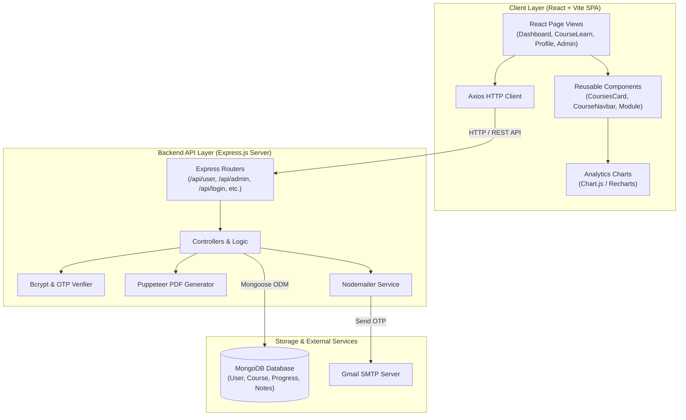

# 📚 EduTrack

EduTrack is a full-stack e-learning platform where users can explore courses, enroll, complete modules via interactive quizzes, and track their learning progress — while admins can monitor learners, manage user-course engagement, and add custom course content.

---

## 🌍 Live Preview & Admin Credentials

- **Live Application:** [https://edu-track-flax.vercel.app/](https://edu-track-flax.vercel.app/)

To simulate the admin view:
- **Email:** `backups795@gmail.com`
- **Password:** `1234`
- *Note:* This is a dummy admin user configured for demo purposes.

---

## 1. System Overview

### High-Level Purpose
EduTrack provides an end-to-end e-learning management experience. Learners can browse available courses, track enrolled/ongoing courses, complete structured video/text modules with quizzes, submit course ratings, and automatically download custom PDF certificates upon 100% completion or monthly learning reports. Administrators have full access to view employee progress, promote users, manage user roles, and construct new course curricula with nested modules, video lectures, and quizzes.

### Core Design Pattern
The platform adheres to a full-stack **MERN Architecture** (MongoDB, Express.js, React, Node.js) with clean client-server separation:
- **Frontend:** Component-driven Single Page Application (SPA) built with React 19, Vite, React Router v7, and Tailwind CSS.
- **Backend:** Layered Express.js REST API structured with Controller-Route handlers, Mongoose schemas/models, and modular service utilities (Nodemailer for OTP authentication, Puppeteer for PDF rendering).

---

## 2. Technology Stack & Dependencies

| Category | Technology / Library | Purpose in this Project |
| :--- | :--- | :--- |
| **Frontend Core** | React v19.1 | UI framework for reactive component rendering |
| **Frontend Build** | Vite v6.3 | Build tool and dev server with Fast Refresh |
| **Routing** | React Router DOM v7.6 | Client-side routing and URL parameter parsing |
| **Styling** | Tailwind CSS v3.4, PostCSS | Utility-first styling for visual design |
| **Data Visualization** | Chart.js v4.5, Recharts v3.2 | Progress timeline charts for user analytics |
| **Icons** | Lucide React v0.511 | UI icons |
| **HTTP Client** | Axios v1.9 | REST API requests from client to backend |
| **Backend Core** | Node.js, Express.js v4.21 | Server runtime and web API server |
| **Database & ORM** | MongoDB, Mongoose v8.15 | NoSQL database and schema modeling |
| **Authentication** | Bcrypt v6.0 | Password salt hashing and verification |
| **Email Service** | Nodemailer v7.0 | OTP verification email delivery |
| **PDF Generation** | Puppeteer v24.10 | Headless Chrome engine for rendering completion certificates & monthly reports |
| **Environment Control** | Dotenv v16.5 | Environment variable configuration |

---

## 3. High-Level Architecture Diagram



---

## 4. Directory & Module Structure

```
EduTrack/
├── client/                      # React Frontend Application
│   ├── public/                  # Static assets
│   ├── src/
│   │   ├── assets/              # Logos and brand images
│   │   ├── components/          # Reusable UI components (Navbar, Cards, Module, Charts, Popups)
│   │   ├── pages/               # Application pages (Login, UserDashboard, AdminDashboard, Profile, etc.)
│   │   ├── styles/              # CSS stylesheets for components and pages
│   │   ├── App.jsx              # React Router definitions
│   │   └── main.jsx             # React entry point
│   ├── package.json             # Frontend dependencies and Vite configuration
│   └── vite.config.js           # Vite settings
└── server/                      # Express Backend Application
    ├── controllers/             # Business logic for user, admin, login, certificate, notes
    ├── database/                # MongoDB connection helper
    ├── middlewares/             # Error handling and 404 middlewares
    ├── models/                  # Mongoose data schemas
    ├── routes/                  # Express API routers
    ├── utils/                   # Nodemailer and OTP generator utilities
    ├── render-postinstall.js    # Platform installer script for Chromium
    ├── server.js                # Server entry point
    └── package.json             # Backend dependencies and startup scripts
```

---

## 5. Data Models & Database Schema

```mermaid
erDiagram
    UserDetails {
        string userid PK "Unique User Identifier / Email"
        string username "Display Name"
        string email "User Email Address"
        string passwordHash "Bcrypt Hashed Password"
        string profilePicture "Profile Picture URL"
        string role "Role: 'user' | 'admin'"
        string position "Job Title / Designation"
        array currentCourses "List of Enrolled Course IDs"
    }

    CourseDetails {
        string courseId PK "Unique Course ID"
        string courseName "Course Name"
        string courseDescription "Course Overview"
        number courseCompletions "Total Completions Count"
        number courseRating "Average Rating (0-5)"
        string courseInstructor "Instructor Name"
        string courseImage "Thumbnail Image URL"
        array tags "Course Tag Strings"
    }

    CourseContent {
        string courseId FK "References CourseDetails.courseId"
        array modules "Nested Modules, Submodules, Videos & Quizzes"
    }

    ProgressData {
        string userId FK "References UserDetails.userid"
        string courseId FK "References CourseDetails.courseId"
        string courseName "Course Name"
        number percentComplete "Percentage (0-100)"
        array progressHistory "Daily Progress Entry Array [{percent, date}]"
        object moduleStatus "2D Matrix of Completed Submodules & Dates"
    }

    CourseNote {
        string userId FK "References UserDetails.userid"
        string courseId FK "References CourseDetails.courseId"
        number moduleNumber "Module Index"
        string text "Note Content Text"
    }

    UserStats {
        string userId FK "References UserDetails.userid"
        number totalEnrolled "Enrolled Course Count"
        number totalCompleted "Completed Course Count"
        number totalOngoing "Ongoing Course Count"
        number averageProgress "Average Completion %"
        number learningStreak "Daily Activity Streak"
        date lastActiveDate "Timestamp of Last Activity"
    }

    otpVerify {
        string useremail PK "Target Email Address"
        number otp "6-digit OTP Code"
    }

    UserDetails ||--o{ ProgressData : "tracks progress"
    UserDetails ||--o{ CourseNote : "writes"
    UserDetails ||--o1 UserStats : "maintains stats"
    CourseDetails ||--o1 CourseContent : "contains content"
    CourseDetails ||--o{ ProgressData : "tracks completion"
```

---

## 6. API Surface, Routes & Interfaces

### Authentication & Password Management (`/api/login`)
| Method | Endpoint | Handler | Description |
| :--- | :--- | :--- | :--- |
| `POST` | `/api/login/existinguser` | `loginValidation` | Authenticates existing user with bcrypt password comparison. |
| `POST` | `/api/login/signup/check` | `checkExistingUser` | Validates if an email is already registered. |
| `POST` | `/api/login/signup/send-otp` | `sendOTPController` | Sends signup verification OTP via email. |
| `POST` | `/api/login/signup/verify-otp` | `verifyOTPController` | Verifies the signup OTP code. |
| `POST` | `/api/login/signup/newuser` | `signupValidation` | Hashes password and creates new user document. |
| `POST` | `/api/login/forgot-password/send-otp` | `sendOTPController` | Sends password reset OTP to email. |
| `POST` | `/api/login/forgot-password/verify-otp` | `verifyOTPController` | Verifies reset OTP code. |
| `POST` | `/api/login/forgot-password/reset-password` | `resetUserPassword` | Updates user password hash in database. |

### User & Learning Routes (`/api/user`)
| Method | Endpoint | Handler | Description |
| :--- | :--- | :--- | :--- |
| `GET` | `/api/user/:userid` | `getAllCourses` | Fetches enrolled, available, and completed courses for user. |
| `GET` | `/api/user/:userid/stats` | `getUserStats` | Calculates learning streak, completion metrics, and stats. |
| `GET` | `/api/user/:userid/:courseId` | `getCourseById` | Retrieves course details, table of contents, and completion %. |
| `GET` | `/api/user/:userid/:courseId/module/:moduleNumber/:subModuleNumber` | `getSubModuleByCourseId` | Fetches submodule video and quiz payload. |
| `GET` | `/api/user/:userid/:courseid/progress` | `getProgressMatrixByCourseId` | Fetches completion matrix for course modules. |
| `GET` | `/api/user/:userid/data/userinfo` | `getUserInfoByUserId` | Fetches user profile information. |
| `PATCH` | `/api/user/:userid/:courseId/progress/:moduleNumber/:subModuleNumber` | `updateProgress` | Marks submodule complete and recalculates percentage. |
| `GET` | `/api/user/:userid/course/search` | `searchCourse` | Filters courses by matching tag queries. |
| `POST` | `/api/user/:userid/:courseid/enroll` | `enrollUserInCourse` | Enrolls user and initializes course progress record. |
| `POST` | `/api/user/:userid/course/:courseid/feedback` | `updateRating` | Submits rating and updates average course rating. |
| `PATCH` | `/api/user/:userid/user/data/editprofile` | `editProfile` | Updates username and profile picture. |

### Admin Routes (`/api/admin`)
| Method | Endpoint | Handler | Auth | Description |
| :--- | :--- | :--- | :--- | :--- |
| `GET` | `/api/admin/:adminid/` | `getAllUsers` | Admin | Fetches list of all registered platform users. |
| `GET` | `/api/admin/:adminid/userdata/:userid` | `getUserById` | Admin | Fetches details for specific user by ID. |
| `GET` | `/api/admin/:adminid/course/allcourses` | `getAllCourses` | Admin | Lists all available courses. |
| `GET` | `/api/admin/:adminid/courseinfo/:courseId` | `getCourseInfoById` | Admin | Fetches course metadata and table of contents. |
| `GET` | `/api/admin/:adminid/allusers/:courseId` | `getUserForCourse` | Admin | Lists users enrolled in a specific course. |
| `GET` | `/api/admin/:adminid/progress/:employeeid` | `getProgressByUserId` | Admin | Fetches progress records for a user across courses. |
| `PUT` | `/api/admin/:adminid/promote/:userid` | `addNewUser` | Admin | Promotes user role to `admin`. |
| `PATCH` | `/api/admin/:adminid/updateuserrole` | `updateUserRole` | Admin | Updates user role dynamically. |
| `POST` | `/api/admin/:adminid/course/addnewcourse` | `addNewCourse` | Admin | Creates new course with modules, videos, and quizzes. |
| `PATCH` | `/api/admin/:adminid/user/data/editprofile` | `editProfileAdmin` | Admin | Modifies admin/user profile metadata. |

### Certificate & Report Routes (`/api/certificate`)
| Method | Endpoint | Handler | Description |
| :--- | :--- | :--- | :--- |
| `POST` | `/api/certificate/` | `generateCertificate` | Renders and downloads A4 landscape course completion PDF certificate. |
| `GET` | `/api/certificate/monthly/:userid` | `generateMonthlyLearningReport` | Renders and downloads monthly learning report PDF. |

---

## 7. Key Data Flows & Sequences

### Module Completion & Certificate Generation

```mermaid
sequenceDiagram
    autonumber
    actor Learner as Learner (Browser)
    participant Client as React App
    participant Server as Express Server
    participant DB as MongoDB
    participant Puppeteer as Puppeteer Engine

    Learner->>Client: Submit Module Quiz
    Client->>Server: PATCH /api/user/:userid/:courseId/progress/:mod/:sub
    Server->>DB: Fetch ProgressData & CourseContent
    Server->>Server: Update 2D matrix & calculate completion %
    Server->>DB: Save updated ProgressData
    Server-->>Client: 200 OK { UpdatedPercentComplete: 100 }
    
    Client-->>Learner: Display Success & Enable Certificate Download
    
    Learner->>Client: Click 