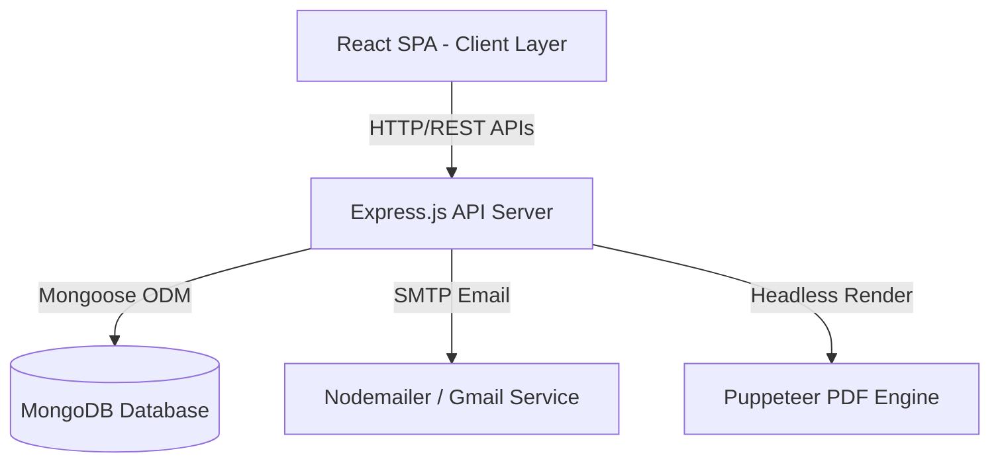

# EduTrack Architecture Documentation

## System Overview
EduTrack is a full-stack e-learning and progress tracking platform built using a decoupled client-server architecture. The frontend is a React Single Page Application (SPA) powered by Vite and React Router, while the backend is a Node.js Express API using MongoDB for data storage and Puppeteer for headless PDF compilation.

## High-Level Architecture Diagram

--- 

## Core System Components

### 1. Frontend Application (`/client`)
- **Framework & Libraries**: React 19, Vite, React Router v7, Tailwind CSS, Lucide React, Chart.js / Recharts.
- **Routing Structure**:
  - `/` - Auth page (`Login.jsx`) handling sign-in, OTP verification, and password reset.
  - `/user/dashboard/:userId` - Learner dashboard (`UserDashboard.jsx`) displaying enrolled & available courses.
  - `/user/profile/:userId` - Profile page (`Profile.jsx`) showcasing completed courses and monthly learning reports.
  - `/course/intro/:userId/:courseId` - Course detail summary (`CourseIntro.jsx`) and enrollment triggers.
  - `/course/learn/:userId/:courseId/:moduleNumber/:subModuleNumber` - Interactive module player (`CourseLearn.jsx` & `Module.jsx`) with inline quizzes and progress sync.
  - `/admin/dashboard/:userId/...` - Administrative pages (`AdminDashboard.jsx`, `EmpProgress.jsx`, `CourseDeets.jsx`, `AddCourse.jsx`) for managing courses, tracking employee progress, and user role management.

### 2. Backend API & Business Logic (`/server`)
- **Framework**: Node.js with Express.js REST API.
- **Route Groups**:
  - `/api/login` - Handles user authentication, registration, OTP creation, and password resets (`loginRouter.js`).
  - `/api/user` - User dashboard metrics, progress updates, course search, and enrollment (`userRouter.js`).
  - `/api/admin` - Admin course management, user role promotion, and progress analytics (`adminRouter.js`).
  - `/api/certificate` - PDF generation engine for certificates and monthly learning reports (`certificateRouter.js`).
  - `/api/notes` - Module-level learner notes creation and management (`notesRouter.js`).
  - `/api/common` - Common utility routes such as user role resolution (`common.js`).

### 3. Database Layer (`/server/models`)
- **Database Engine**: MongoDB with Mongoose ODM.
- **Data Schemas**:
  - `UserDetails`: Stores user accounts, bcrypt password hashes, profile images, positions, and assigned roles (`user` / `admin`).
  - `CourseDetails`: Catalog metadata including instructor, description, rating, completion counter, tags, and intro video.
  - `CourseContent`: Hierarchical structure containing modules, submodules, video assets, and multiple-choice quiz questions.
  - `ProgressData`: Tracks individual user module completion matrices (`completedModules`), percent metrics, and historical progress timelines (`progressHistory`).
  - `UserStats`: Aggregated metrics including learning streak, total enrolled, total completed, and last active timestamp.
  - `CourseNote`: Module-specific user notes scoped by user and course.
  - `AuthOTP`: Temporary 6-digit OTP codes for email verification.

--- 

## Key Data Flows & Architectural Workflows

### 1. Authentication & OTP Verification
1. User submits registration or password reset request.
2. Server generates a random 6-digit OTP via `generateOTP.js` and upserts it to the `AuthOTP` collection.
3. `sendOTP.js` dispatches an HTML email via Nodemailer.
4. User verifies the code; upon validation, password hashes are updated or new user accounts are persisted using `bcrypt` salting.

### 2. Module Progress Calculation Matrix
- Each course progress entry maintains a 2D boolean array (`completedModules`) matching `[moduleIndex][subModuleIndex]`.
- Completing a submodule quiz marks the corresponding cell `true` and updates `percentComplete` proportionally.
- First-of-day progress points are logged into `progressHistory` to feed visual trend charts in `UserProgressChartJS.jsx`.

### 3. Automated PDF Report & Certificate Generation
- PDF generation is handled server-side in `controllers/certificate.js` using Puppeteer.
- HTML templates styled for A4 standards (landscape for certificates, portrait for monthly reports) are populated with database metrics.
- A headless Chromium instance converts the HTML into binary PDF streams delivered directly to the client.