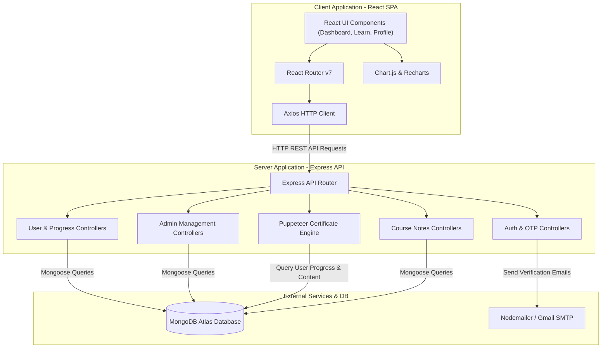
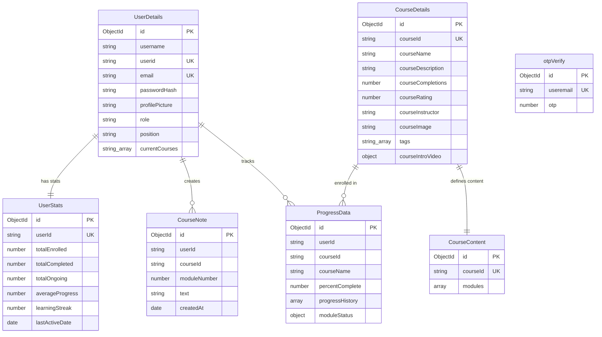
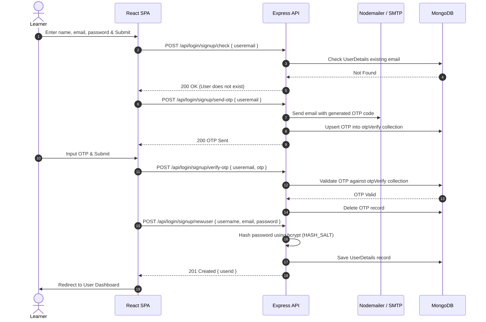
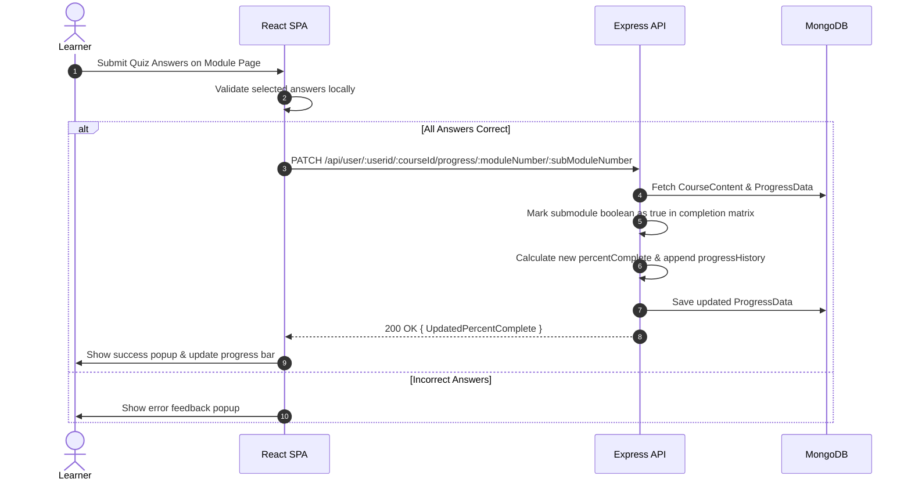

# 📚 EduTrack - System Architecture & Technical Documentation

EduTrack is a full-stack e-learning platform where users can explore courses, enroll, complete modules via interactive quizzes, track learning progress over time, and download PDF certificates/reports. Admins can manage courses, track individual user progress, and monitor overall platform statistics.

---

## 🌍 Live Preview & Admin Credentials
- **Live Application:** [https://edu-track-flax.vercel.app/](https://edu-track-flax.vercel.app/)
- **Demo Admin View Account:**
  - **Email:** `backups795@gmail.com`
  - **Password:** `1234`
  - *Note: This is a dummy user account configured to simulate the admin view.* 

---

## 1. System Overview

### High-Level Purpose
EduTrack provides a structured learning management environment for employees and learners. It enables interactive video learning, quiz-based progress validation, automatic progress graph visualization, custom note-taking per module, and headless-browser generation of PDF completion certificates and monthly learning reports.

### Core Design Pattern
- **Client:** Component-Based Single Page Application (SPA) utilizing React 19, React Router v7 for client-side routing, and Tailwind CSS + custom CSS for styling.
- **Server:** Layered Controller-Service-Model architecture built with Express.js and Node.js. State and data persistence are handled via MongoDB using Mongoose schemas. Authentication relies on salted `bcrypt` password hashing and email-based OTP verification via Nodemailer.

---

## 2. Technology Stack & Dependencies

| Category | Technology / Library | Purpose in EduTrack |
| :--- | :--- | :--- |
| **Frontend Core** | React 19 (`react`, `react-dom`) | UI component library and state management |
| **Frontend Build Tool** | Vite | Rapid frontend tooling and bundler |
| **Routing** | React Router v7 (`react-router-dom`) | Client-side page navigation and parameter parsing |
| **Data Visualization** | Chart.js (`react-chartjs-2`), Recharts | Historical learning progress line charts |
| **Icons & UI** | Lucide React | UI iconography |
| **HTTP Client** | Axios | REST API communication with the Express backend |
| **Styling** | Tailwind CSS, PostCSS, Autoprefixer | Utility-first CSS layout styling |
| **Backend Core** | Node.js, Express.js | Core Web API server implementation |
| **Database & ORM** | MongoDB, Mongoose v8 | Persistent document storage and schema modeling |
| **Authentication & Security** | bcrypt, Nodemailer | Password salt-and-hashing, OTP email transport |
| **Document Generation** | Puppeteer v24 | Headless Chrome automation for generating PDF certificates and monthly reports |
| **Runtime Utilities** | `dotenv`, `express-async-errors`, `cors` | Environment handling, async exception catching, and CORS policy management |

---

## 3. High-Level Architecture Diagram



---

## 4. Directory & Module Structure

```text
EduTrack/
├── client/                         # Frontend React + Vite application
│   ├── src/
│   │   ├── assets/                 # Static brand assets (logo, images)
│   │   ├── components/             # Reusable UI components
│   │   │   ├── AdminAvailableCourse.jsx # Admin view for course list
│   │   │   ├── CourseDetails.jsx   # Course introduction and certificate trigger
│   │   │   ├── CourseNavbar.jsx    # Learning sidebar module list
│   │   │   ├── EditProfile.jsx     # Profile editing modal
│   │   │   ├── Module.jsx          # Module lecture video & quiz interface
│   │   │   ├── Navbar.jsx          # Primary application header & search
│   │   │   └── UserProgressChartJS.jsx # Historical progress graph
│   │   ├── pages/                  # Page route components
│   │   │   ├── AddCourse.jsx       # Admin course creation interface
│   │   │   ├── AdminDashboard.jsx  # Admin panel navigation host
│   │   │   ├── CourseDeets.jsx     # Admin detailed course progress view
│   │   │   ├── CourseLearn.jsx     # Learner video & quiz page
│   │   │   ├── EmpProgress.jsx     # Admin employee detail view
│   │   │   ├── Login.jsx           # Signup, login, & password reset form
│   │   │   ├── Profile.jsx         # User profile & certificate downloads
│   │   │   └── UserDashboard.jsx   # Main learner course dashboard
│   │   ├── styles/                 # Page and component CSS stylesheets
│   │   ├── App.jsx                 # Route configurations
│   │   └── main.jsx                # DOM entry point
│   └── package.json
└── server/                         # Backend Express Node.js application
    ├── controllers/                # Business logic handlers
    │   ├── admin.js                # Admin user and course management logic
    │   ├── certificate.js          # Puppeteer PDF generation engines
    │   ├── login.js                # Signup, login validation, password resets
    │   ├── notes.js                # User per-module note management
    │   ├── otpAuth.js              # OTP generation & verification logic
    │   └── user.js                 # Course enrollment, progress matrix, stats
    ├── database/
    │   └── connect.js              # MongoDB connection instance
    ├── middlewares/                # Error handling & 404 middlewares
    ├── models/                     # Mongoose database collection schemas
    │   ├── authOTP.js              # OTP code collection schema
    │   ├── courseContent.js        # Modules, submodules & quiz schema
    │   ├── courseDetails.js        # Course metadata schema
    │   ├── courseNote.js           # Learner module notes schema
    │   ├── courseProgress.js       # Learner completion matrix & history schema
    │   ├── userDetails.js          # User profile & account schema
    │   └── userStats.js            # User aggregate statistics schema
    ├── routes/                     # Express REST route endpoints
    ├── utils/                      # Helper utilities (Nodemailer setup, OTP gen)
    ├── server.js                   # Application entry point & server setup
    └── package.json
```

---

## 5. Data Models & Database Schema



---

## 6. API Surface, Routes & Interfaces

### Authentication Routes (`/api/login`)
| Method | Endpoint | Handler | Description |
| :--- | :--- | :--- | :--- |
| `POST` | `/signup/check` | `checkExistingUser` | Checks if user email is already registered |
| `POST` | `/signup/send-otp` | `sendOTPController` | Generates and emails verification OTP |
| `POST` | `/signup/verify-otp` | `verifyOTPController` | Validates signup OTP |
| `POST` | `/signup/newuser` | `signupValidation` | Registers new user with bcrypt-hashed password |
| `POST` | `/existinguser` | `loginValidation` | Authenticates user credentials |
| `POST` | `/forgot-password/send-otp` | `sendOTPController` | Sends password reset OTP |
| `POST` | `/forgot-password/verify-otp` | `verifyOTPController` | Verifies reset OTP |
| `POST` | `/forgot-password/reset-password` | `resetUserPassword` | Updates user password |

### Learner Routes (`/api/user`)
| Method | Endpoint | Handler | Description |
| :--- | :--- | :--- | :--- |
| `GET` | `/:userid` | `getAllCourses` | Retrieves enrolled, available, and completed courses |
| `GET` | `/:userid/stats` | `getUserStats` | Calculates learning streak and aggregate metrics |
| `GET` | `/:userid/data/userinfo` | `getUserInfoByUserId` | Gets public profile information |
| `GET` | `/:userid/:courseId` | `getCourseById` | Fetches course details and overall progress |
| `GET` | `/:userid/:courseId/module/:moduleNumber/:subModuleNumber` | `getSubModuleByCourseId` | Fetches lecture video and quiz questions |
| `GET` | `/:userid/:courseid/progress` | `getProgressMatrixByCourseId` | Fetches completion matrix |
| `PATCH` | `/:userid/:courseId/progress/:moduleNumber/:subModuleNumber` | `updateProgress` | Marks submodule complete and updates percentage |
| `POST` | `/:userid/:courseid/enroll` | `enrollUserInCourse` | Enrolls user in course and initializes progress document |
| `POST` | `/:userid/course/:courseid/feedback` | `updateRating` | Submits rating feedback for course |
| `GET` | `/:userid/course/search` | `searchCourse` | Searches courses by tag intersection |
| `PATCH` | `/:userid/user/data/editprofile` | `editProfile` | Updates user avatar and profile details |

### Admin Routes (`/api/admin`)
| Method | Endpoint | Handler | Description |
| :--- | :--- | :--- | :--- |
| `GET` | `/:adminid/` | `getAllUsers` | Retrieves all registered platform users |
| `GET` | `/:adminid/userdata/:userid` | `getUserById` | Retrieves specific user profile |
| `GET` | `/:adminid/course/allcourses` | `getAllCourses` | Retrieves all platform courses |
| `GET` | `/:adminid/courseinfo/:courseId` | `getCourseInfoById` | Retrieves course metadata and table of contents |
| `GET` | `/:adminid/allusers/:courseId` | `getUserForCourse` | Fetches all users enrolled in a specific course |
| `GET` | `/:adminid/progress/:employeeid` | `getProgressByUserId` | Retrieves course progress for an individual user |
| `POST` | `/:adminid/course/addnewcourse` | `addNewCourse` | Creates a new course with modules, lectures, and quizzes |
| `PUT` | `/:adminid/promote/:userid` | `addNewUser` | Promotes user role to admin |
| `PATCH` | `/:adminid/updateuserrole` | `updateUserRole` | Modifies user account role |
| `PATCH` | `/:adminid/user/data/editprofile` | `editProfileAdmin` | Edits user details on behalf of admin |

### Document Routes (`/api/certificate`)
| Method | Endpoint | Handler | Description |
| :--- | :--- | :--- | :--- |
| `POST` | `/` | `generateCertificate` | Generates a custom PDF course certificate via Puppeteer |
| `GET` | `/monthly/:userid` | `generateMonthlyLearningReport` | Generates a monthly learning progress report PDF (Rate Limited) |

### Notes Routes (`/api/notes`)
| Method | Endpoint | Handler | Description |
| :--- | :--- | :--- | :--- |
| `GET` | `/:userid/:courseId/module/:moduleNumber` | `getNotesByModule` | Fetches learner notes for a specific module |
| `POST` | `/:userid/:courseId/module/:moduleNumber` | `createNote` | Creates a module note |
| `DELETE` | `/:userid/note/:noteId` | `deleteNote` | Deletes a module note |

---

## 7. Key Data Flows & Sequences

### User Signup & OTP Verification



### Module Completion & Progress Updates



---

## 8. Configuration & Environment Variables

### Server Environment Variables (`server/.env`)
| Variable | Type | Description |
| :--- | :--- | :--- |
| `PORT` | Number | Server HTTP port (Default: `5000` / `3000`) |
| `MONGO_URI` | String | MongoDB connection URI |
| `HASH_SALT` | Number | Number of salt rounds for `bcrypt` password hashing (e.g., `10`) |
| `USER_EMAIL` | String | Gmail email address for sending OTP emails |
| `EMAIL_PASSWORD` | String | Gmail App Password for SMTP authentication |

### Client Environment Variables (`client/.env`)
| Variable | Type | Description |
| :--- | :--- | :--- |
| `VITE_API_BASE_URL` | String | Backend API base URL (e.g., `http://localhost:5000` or production URL) |

---

## 🛠️ Setup Instructions

### 1. Clone the Repository
```bash
git clone https://github.com/abdul8704/EduTrack.git
cd EduTrack
```

### 2. Install Dependencies
```bash
# Install client dependencies
cd client
npm install

# Install server dependencies
cd ../server
npm install
```

### 3. Environment Setup
Create a `.env` file in the `server` directory:
```env
PORT=5000
MONGO_URI=your_mongo_uri_here
HASH_SALT=10
USER_EMAIL=your_email_here
EMAIL_PASSWORD=your_email_app_password
```

Create a `.env` file in the `client` directory:
```env
VITE_API_BASE_URL=http://localhost:5000
```

### 4. Run the Application
```bash
# Run the server
cd server
npm run start

# Run the client in a separate terminal
cd client
npm run dev
```