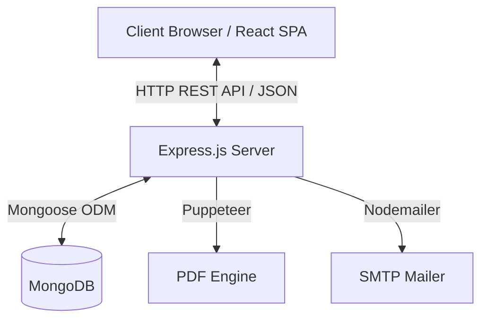
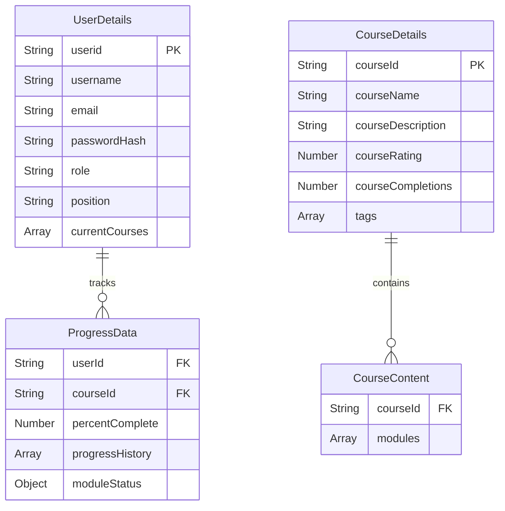

# 🏗️ EduTrack Architecture Documentation

Welcome to the architecture documentation for **EduTrack**, a full-stack e-learning management system designed for interactive learning and admin-level learner management.

---

## 💡 System Overview

EduTrack operates on a classic decoupled Client-Server architecture utilizing a MongoDB database:
- **Frontend**: Single Page Application (SPA) built with React.js, Vite, and Tailwind CSS.
- **Backend**: Node.js and Express RESTful API server handling business logic, data persistence, dynamic PDF report generation, and automated email notifications.
- **Database**: MongoDB with Mongoose ODM for multi-document relational data models.

---

## 🎨 Frontend Architecture

The frontend application (`client/`) is built using modern React pattern practices, utilizing React Router v7 for client-side routing and Axios for backend interactions.

### Core Route Map

| Path | Component | Description |
| :--- | :--- | :--- |
| `/` | `Login` | User authentication (Sign in, Sign up with OTP, Password Reset) |
| `/user/dashboard/:userId` | `UserDashboard` | Main learner dashboard showing enrolled and available courses |
| `/user/profile/:userId` | `Profile` | User profile, certificate management, and monthly PDF report downloads |
| `/course/intro/:userId/:courseId` | `CourseIntro` | Detailed course overview, video preview, and table of contents |
| `/course/learn/:userId/:courseId/:moduleNumber/:subModuleNumber` | `CourseLearn` | Interactive learning workspace featuring lesson videos, quizzes, and note-taking |
| `/course/search/:userId/tags/:tags` | `SearchResult` | Tag-based course search results |
| `/admin/dashboard/:userId/:navId/details` | `AdminDashboard` | Administrator overview for monitoring users and managing course catalogs |
| `/admin/dashboard/:userId/details/emp/:empId` | `EmpProgress` | Admin inspection view for individual learner progress |
| `/admin/dashboard/:userId/details/course/:courseId` | `CourseDeets` | Admin detailed analytics for a specific course |
| `/admin/dashboard/:userId/course/addcourse` | `AddCourse` | Multi-step dynamic form to publish new courses, modules, and quizzes |

---

## ⚙️ Backend Architecture

The backend server (`server/`) is structured around modular REST APIs, separated by domain-specific routers and controllers.

### Domain Architecture & Controllers

- **User Controller (`server/controllers/user.js`)**: Manages course enrollment, progress evaluation matrix updates, tag searching, stats aggregation, and profile updates.
- **Admin Controller (`server/controllers/admin.js`)**: Oversees system-wide metrics, user promotion to admin roles, user progress tracking across courses, and new course publishing.
- **Auth Controller (`server/controllers/login.js`, `server/controllers/otpAuth.js`)**: Handles secure user registration, salted password hashing via bcrypt, and email OTP verification.
- **Certificate Controller (`server/controllers/certificate.js`)**: Spawns headless Chrome instances via Puppeteer to render responsive HTML/CSS certificate templates directly into PDF buffers.
- **Notes Controller (`server/controllers/notes.js`)**: Enables module-scoped note creation and retrieval for individual learners.

---

## 📊 Data Models & Schema Design

Data persistence is managed using Mongoose models (`server/models/`):

### Key Models Overview
- **`UserDetails`**: Stores user identity, hashed passwords, user roles (`user` or `admin`), and current course subscriptions.
- **`CourseDetails`**: Contains high-level metadata regarding published courses, instructor details, ratings, and video preview links.
- **`CourseContent`**: Holds structured course curricula, including module hierarchies, submodules, video lesson URLs, and quiz question option sets.
- **`ProgressData`**: Maintains boolean completion matrices per submodule and tracks historical progression points over time.
- **`CourseNote`**: Stores module-specific user notes scoped by user and course.
- **`UserStats`**: Aggregates user analytics including learning streak tracking and completed module tallies.

---

## 🔐 Key Workflows & Operations

### 1. Dynamic Progress Evaluation Matrix
When a user completes a submodule quiz:
1. The client sends a completion payload to `PATCH /api/user/:userid/:courseId/progress/:moduleNumber/:subModuleNumber`.
2. The server normalizes the `moduleStatus` matrix for the course.
3. Upon verifying quiz completion, it marks the matrix index cell `completedModules[moduleIndex][subModuleIndex]` as `true` and logs the completion timestamp.
4. Overall completion percentage is dynamically calculated based on completed vs. total submodules, updating user statistics and progress history.

### 2. Puppeteer PDF Generation Pipeline
1. Users request completion certificates or monthly learning summaries.
2. Express routes pass parameters to `certificate.js`.
3. The backend dynamically constructs styled HTML templates containing safe HTML-escaped string payloads.
4. Puppeteer launches a headless browser, renders the HTML page with configured A4 print viewports, generates an in-memory PDF buffer, and streams it back to the client as a download attachment.

---

## 🛡️ Security & Environment Setup

- **Password Security**: Passwords are salted and hashed using `bcrypt` prior to database insertion.
- **Credentials Isolation**: Database URI, port variables, salt rounds, and SMTP passwords reside strictly in `.env` files.
- **Rate Limiting**: Critical endpoints (such as monthly report exports) feature window-based rate limiting middleware.