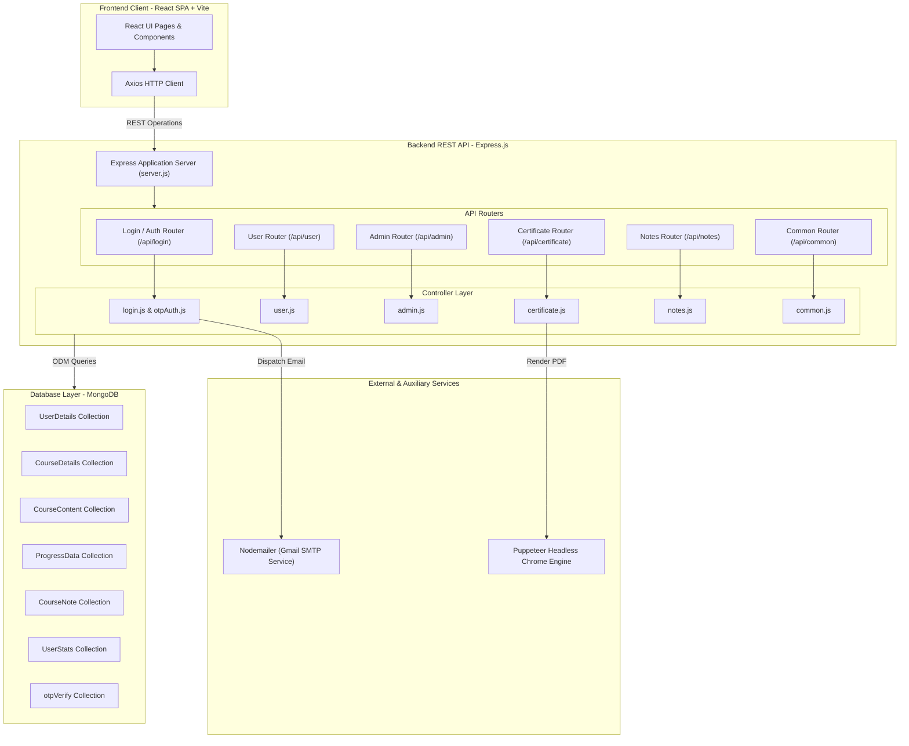
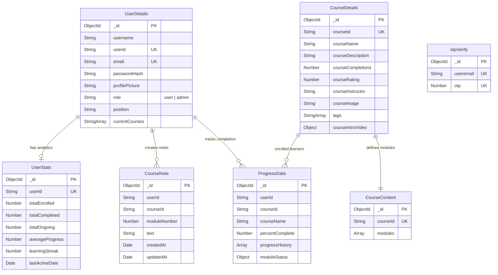
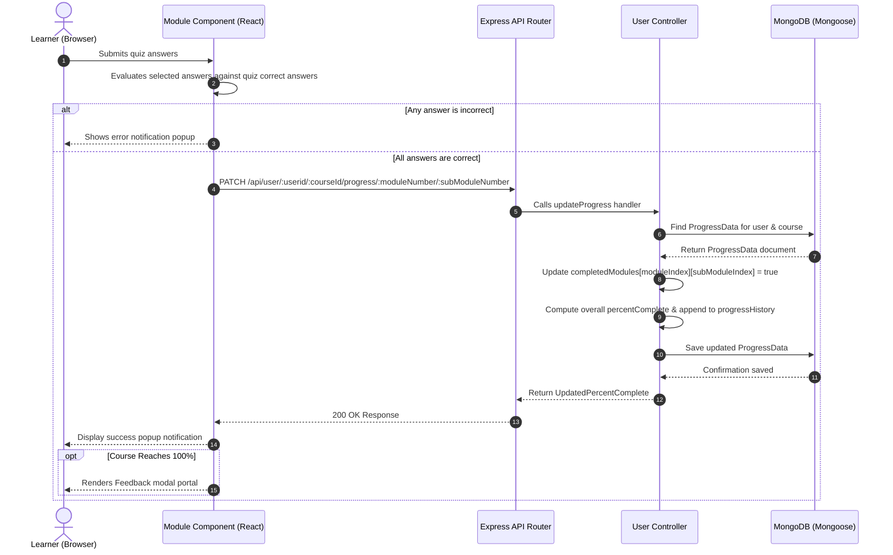

# System Architecture & Technical Documentation

## 1. System Overview
* **High-Level Purpose:** EduTrack is a full-stack e-learning and learning management system (LMS) designed to facilitate online learning, course content delivery, module-level progress tracking, interactive quiz evaluation, PDF certificate/report generation, and administrative monitoring of learner performance.
* **Core Design Pattern:** The application implements a decoupled architecture:
  * **Frontend:** Single Page Application (SPA) built with React 19, Vite, and React Router DOM v7, utilizing Axios for asynchronous HTTP communications.
  * **Backend:** Layered RESTful API built on Node.js and Express.js, organized into explicit router, controller, middleware, and data model layers.
  * **Database:** MongoDB document store accessed via Mongoose ODM for persistence of users, course structures, progress matrices, notes, statistics, and OTP tokens.

---

## 2. Technology Stack & Dependencies

| Category | Technology / Library | Purpose in this Project |
| :--- | :--- | :--- |
| Frontend Framework | React.js (v19.1.0) | Declarative UI library for component construction |
| Build Tool & Dev Server | Vite (v6.3.5) | Next-generation frontend tooling and fast HMR |
| Client Routing | React Router DOM (v7.6.1) | Declarative client-side routing and page dynamic parameter navigation |
| HTTP Client | Axios (v1.9.0) | Promise-based HTTP client for API interactions |
| Data Visualization | Recharts (v3.2.1), Chart.js (v4.5.0), react-chartjs-2 (v5.3.0) | Rendering linear course progress charts and historical user performance graphs |
| Styling & Icons | Tailwind CSS (v3.4.17), Lucide React (v0.511.0) | Utility-first styling framework and modern icon collection |
| Backend Runtime | Node.js | Server-side JavaScript runtime environment |
| Web Framework | Express.js (v4.21.2) | Middleware-driven HTTP server for REST API endpoints |
| Database & ODM | MongoDB & Mongoose (v8.15.0) | NoSQL document database and schema object modeling |
| Security & Authentication | Bcrypt (v6.0.0) | Password hashing with configurable salt rounds |
| Email Transport | Nodemailer (v7.0.3) | Sending One-Time Passwords (OTP) via SMTP for verification and reset workflows |
| PDF Document Generation | Puppeteer (v24.10.0) | Headless Chromium browser automation for generating A4 Certificates and Monthly Reports |

---

## 3. High-Level Architecture Diagram



---

## 4. Directory & Module Structure

```
EduTrack/
├── README.md                   # Global application overview and quickstart guide
├── client/                     # Frontend Application (React + Vite)
│   ├── package.json            # Client dependencies and npm scripts
│   ├── vite.config.js          # Vite build plugin and server configuration
│   ├── index.html              # Core HTML entry document
│   └── src/
│       ├── App.jsx             # React Router routing definition
│       ├── main.jsx            # DOM mounting and application entry
│       ├── components/         # Reusable presentation and functional components
│       │   ├── Navbar.jsx      # Navigation bar with integrated course search
│       │   ├── CourseNavbar.jsx# Sidebar module navigator with status indicators
│       │   ├── Module.jsx      # Module view rendering video and quiz questions
│       │   ├── CourseDetails.jsx# Course landing overview & certificate action
│       │   ├── EditProfile.jsx # Profile edit modal dialog
│       │   ├── UserProgressChartJS.jsx # Reusable Chart.js line graph for completion rates
│       │   └── ...
│       ├── pages/              # Top-level view containers
│       │   ├── Login.jsx       # Auth login, signup, OTP verification, and password reset
│       │   ├── UserDashboard.jsx# Learner dashboard showing enrolled & available courses
│       │   ├── AdminDashboard.jsx# Admin monitoring portal
│       │   ├── CourseIntro.jsx # Course information view
│       │   ├── CourseLearn.jsx # Interactive course workspace page
│       │   ├── AddCourse.jsx   # Dynamic multi-step course creation form
│       │   ├── EmpProgress.jsx # Individual learner progress tracking view for admins
│       │   ├── CourseDeets.jsx # Course enrollment and progress listing view for admins
│       │   └── Profile.jsx     # User profile, completed courses, & monthly report export
│       └── styles/             # Dedicated CSS stylesheets per view/component
└── server/                     # Backend REST API Application (Express + Node.js)
    ├── server.js               # Entry script configuring middleware, CORS, database, & server
    ├── package.json            # Server package metadata & scripts
    ├── render-postinstall.js   # Linux postinstall script for automated Puppeteer Chromium installation
    ├── database/
    │   └── connect.js          # Mongoose database connection client setup
    ├── middlewares/
    │   ├── error-handler.js    # Global async error catch-all middleware
    │   └── not-found.js        # 404 Route handling fallback
    ├── models/                 # Mongoose Data Schemas
    │   ├── userDetails.js      # User credentials, roles, and profile metadata
    │   ├── courseDetails.js    # Metadata for course catalog listings
    │   ├── courseContent.js    # Nested structure of modules, submodules, videos, & quizzes
    │   ├── courseProgress.js   # Matrix-based submodule status and progress history
    │   ├── courseNote.js       # Learner notes saved per course module
    │   ├── userStats.js        # Aggregated streak and completion metrics
    │   └── authOTP.js          # One-Time Password storage for email authentication
    ├── controllers/            # Core business logic layer
    │   ├── admin.js            # Admin user management, course creation, and tracking handlers
    │   ├── user.js             # User dashboards, course enrollment, progress updates, and stats
    │   ├── login.js            # Authentication, registration validation, and password resets
    │   ├── otpAuth.js          # OTP code generation and verification processing
    │   ├── certificate.js      # Puppeteer HTML-to-PDF certificate and report generators
    │   ├── notes.js            # Module note creation, retrieval, and deletion
    │   └── common.js           # Shared profile role checker
    ├── routes/                 # Express Endpoint Routers
    │   ├── adminRouter.js      # /api/admin endpoints
    │   ├── userRouter.js       # /api/user endpoints
    │   ├── loginRouter.js      # /api/login endpoints
    │   ├── certificateRouter.js# /api/certificate endpoints
    │   ├── notesRouter.js      # /api/notes endpoints
    │   └── common.js           # /api/common endpoints
    └── utils/                  # Helper utilities
        ├── generateOTP.js      # Random 6-digit numerical OTP generator
        ├── nodemailer.js       # SMTP transport initialization
        └── sendOTP.js          # HTML email template formatter and transport dispatcher
```

---

## 5. Data Models & Database Schema



---

## 6. API Surface, Routes & Interfaces

### Authentication & Account Routes (`/api/login`)
| Method | Endpoint | Handler | Auth Required | Description |
| :--- | :--- | :--- | :--- | :--- |
| `POST` | `/api/login/existinguser` | `loginValidation` | None | Authenticates email & password against stored bcrypt hashes |
| `POST` | `/api/login/signup/check` | `checkExistingUser` | None | Checks if user email is already registered |
| `POST` | `/api/login/signup/send-otp` | `sendOTPController` | None | Generates and dispatches an OTP verification code via email |
| `POST` | `/api/login/signup/verify-otp` | `verifyOTPController` | None | Verifies the submitted OTP against stored value |
| `POST` | `/api/login/signup/newuser` | `signupValidation` | None | Registers a new account with hashed password |
| `POST` | `/api/login/forgot-password/send-otp` | `sendOTPController` | None | Sends a password reset OTP to user email |
| `POST` | `/api/login/forgot-password/verify-otp` | `verifyOTPController` | None | Verifies password reset OTP |
| `POST` | `/api/login/forgot-password/reset-password` | `resetUserPassword` | None | Updates user account password hash |

### Learner Operations (`/api/user`)
| Method | Endpoint | Handler | Auth Required | Description |
| :--- | :--- | :--- | :--- | :--- |
| `GET` | `/api/user/:userid` | `getAllCourses` | User | Fetches user's enrolled, available, and completed courses |
| `GET` | `/api/user/:userid/stats` | `getUserStats` | User | Calculates user stats, progress averages, and streaks |
| `GET` | `/api/user/:userid/:courseId` | `getCourseById` | User | Fetches course landing details, contents, and user progress |
| `GET` | `/api/user/:userid/:courseId/module/:moduleNumber/:subModuleNumber` | `getSubModuleByCourseId` | User | Retrieves specific submodule video link, title, and quiz |
| `GET` | `/api/user/:userid/:courseid/progress` | `getProgressMatrixByCourseId` | User | Returns boolean completion matrix for modules |
| `GET` | `/api/user/:userid/data/userinfo` | `getUserInfoByUserId` | User | Returns user account details |
| `PATCH` | `/api/user/:userid/:courseId/progress/:moduleNumber/:subModuleNumber` | `updateProgress` | User | Updates submodule completion matrix, recalculates percent complete, and appends progress history |
| `GET` | `/api/user/:userid/course/search` | `searchCourse` | User | Performs search query on courses using matching tags |
| `POST` | `/api/user/:userid/:courseid/enroll` | `enrollUserInCourse` | User | Enrolls user in a course and initializes empty completion matrix |
| `POST` | `/api/user/:userid/course/:courseid/feedback` | `updateRating` | User | Updates cumulative rating and completion counts for a course |
| `PATCH` | `/api/user/:userid/user/data/editprofile` | `editProfile` | User | Updates user display name and profile picture URL |

### Administrative Operations (`/api/admin`)
| Method | Endpoint | Handler | Auth Required | Description |
| :--- | :--- | :--- | :--- | :--- |
| `GET` | `/api/admin/:adminid/course/allcourses` | `getAllCourses` | Admin | Fetches list of all active catalog courses |
| `GET` | `/api/admin/:adminid/` | `getAllUsers` | Admin | Retrieves all registered system users |
| `GET` | `/api/admin/:adminid/userdata/:userid` | `getUserById` | Admin | Fetches individual user profile information |
| `GET` | `/api/admin/:adminid/progress/:employeeid` | `getProgressByUserId` | Admin | Fetches course progress list for a specific employee |
| `GET` | `/api/admin/:adminid/allusers/:courseId` | `getUserForCourse` | Admin | Returns list of all learners enrolled in a course with completion histories |
| `GET` | `/api/admin/:adminid/courseinfo/:courseId` | `getCourseInfoById` | Admin | Fetches course overview and table of contents |
| `POST` | `/api/admin/:adminid/course/addnewcourse` | `addNewCourse` | Admin | Creates a new course along with modules, submodules, video links, and quizzes |
| `PUT` | `/api/admin/:adminid/promote/:userid` | `addNewUser` | Admin | Promotes target user to Admin role |
| `PATCH` | `/api/admin/:adminid/updateuserrole` | `updateUserRole` | Admin | Updates user role explicitly |
| `PATCH` | `/api/admin/:adminid/user/data/editprofile` | `editProfileAdmin` | Admin | Administrative profile detail editor |

### Document Generation (`/api/certificate`)
| Method | Endpoint | Handler | Auth Required | Description |
| :--- | :--- | :--- | :--- | :--- |
| `POST` | `/api/certificate/` | `generateCertificate` | None | Renders and streams an A4 landscape PDF Certificate of Completion |
| `GET` | `/api/certificate/monthly/:userid` | `generateMonthlyLearningReport` | Rate-Limited | Renders and streams an A4 PDF summary report of monthly completed modules |

### Module Notes (`/api/notes`)
| Method | Endpoint | Handler | Auth Required | Description |
| :--- | :--- | :--- | :--- | :--- |
| `GET` | `/api/notes/:userid/:courseId/module/:moduleNumber` | `getNotesByModule` | User | Retrieves user notes for a specific module |
| `POST` | `/api/notes/:userid/:courseId/module/:moduleNumber` | `createNote` | User | Saves a new text note for a course module |
| `DELETE` | `/api/notes/:userid/note/:noteId` | `deleteNote` | User | Deletes a specified note entry |

### Shared / Common (`/api/common`)
| Method | Endpoint | Handler | Auth Required | Description |
| :--- | :--- | :--- | :--- | :--- |
| `GET` | `/api/common/profile/role/:userid` | `getRole` | User | Returns the specific user's assigned role |

---

## 7. Key Data Flows & Sequences

### Quiz Evaluation and Progress Update Sequence



---

## 8. Configuration & Environment Variables

### Backend Environment Variables (`server/.env`)
| Variable Name | Required | Default | Description |
| :--- | :--- | :--- | :--- |
| `PORT` | Optional | `3000` / `5000` | Port number for Express server HTTP connection |
| `MONGO_URI` | Required | N/A | MongoDB connection string (local or MongoDB Atlas) |
| `HASH_SALT` | Required | `10` | Salt round count used by Bcrypt for password hashing |
| `USER_EMAIL` | Required | N/A | Sender Gmail/SMTP email address for dispatching OTP messages |
| `EMAIL_PASSWORD` | Required | N/A | App password/credential for SMTP authentication |

### Frontend Environment Variables (`client/.env`)
| Variable Name | Required | Default | Description |
| :--- | :--- | :--- | :--- |
| `VITE_API_BASE_URL` | Required | `http://localhost:5000` | Base HTTP endpoint for client Axios API requests |