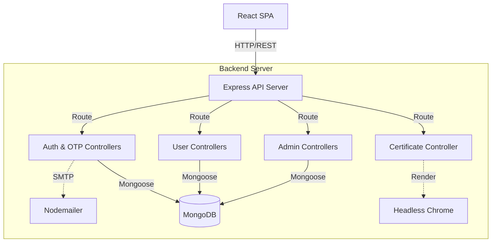
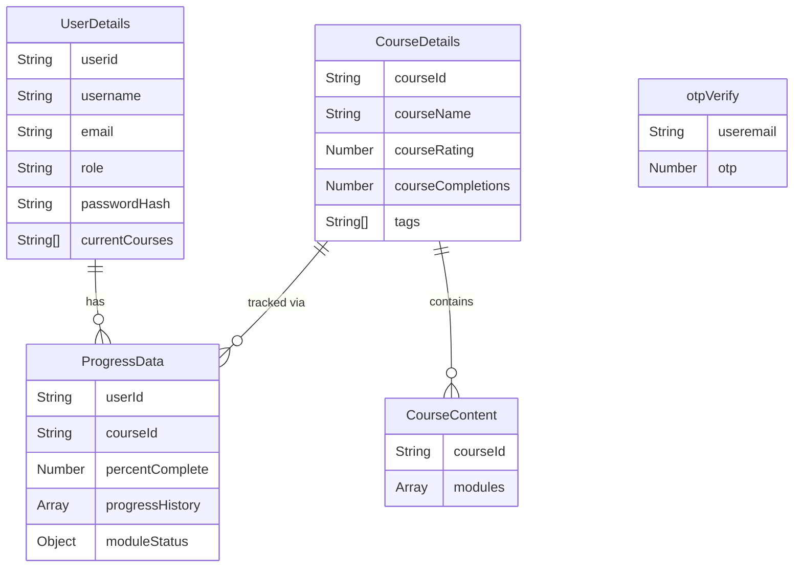

# EduTrack

## What this system is
EduTrack is a full-stack e-learning platform where users can explore courses, enroll, take quizzes, and track their learning progress. It includes an administrative interface for monitoring learners and managing user-course engagement. The system is designed to provide secure authentication, structured course content delivery, and automated certificate generation upon course completion.

## Tech stack
- **React** (v19.1.0): Frontend user interface framework.
- **Vite** (v6.3.5): Frontend build tool and development server.
- **Express** (v4.21.2): Backend web framework for serving the REST API.
- **Mongoose** (v8.15.0): Object Data Modeling (ODM) library for MongoDB.
- **bcrypt** (v6.0.0): Hashing library used for securely storing user passwords.
- **puppeteer** (v24.10.0): Headless Chrome API used to generate PDF certificates.
- **nodemailer** (v7.0.3): Email sending library used for dispatching OTP verification codes.
- **Recharts** (v3.2.1) / **Chart.js** (v4.5.0): Libraries used for rendering progress charts on the frontend.

## How it works
The system operates as a decoupled single-page application (SPA) and REST API backend. The entry point for users is the React frontend (`App.jsx`), where they are routed to either a login/signup flow or directly to their dashboard if authenticated. 

When a user interacts with the app (e.g., enrolling in a course, submitting a quiz, or viewing a profile), the frontend dispatches HTTP requests using `axios` to the Express backend. The backend controllers query or mutate state in MongoDB via Mongoose models. For example, completing a course module updates the `ProgressData` document, recalculating the completion percentage. Once a course reaches 100% completion, the frontend can request a certificate. The backend uses Puppeteer to render an HTML certificate template and returns it as a downloadable PDF blob to the client.

## Component diagram


## Data model


## API surface

### Authentication & Login
- `POST /api/login/signup/newuser` - Registers a new user. [server/routes/loginRouter.js:9]
- `POST /api/login/existinguser` - Authenticates a user and returns their role/info. [server/routes/loginRouter.js:15]
- `POST /api/login/signup/send-otp` - Generates and emails an OTP for signup. [server/routes/loginRouter.js:12]
- `POST /api/login/signup/verify-otp` - Verifies the submitted OTP. [server/routes/loginRouter.js:13]
- `POST /api/login/forgot-password/reset-password` - Resets a user's password using an OTP flow. [server/routes/loginRouter.js:20]

### User Operations
- `GET /api/user/:userid` - Retrieves all courses, categorizing them into available, enrolled, and completed for the user. [server/routes/userRouter.js:5]
- `GET /api/user/:userid/:courseId` - Retrieves course details and current user progress. [server/routes/userRouter.js:6]
- `POST /api/user/:userid/:courseid/enroll` - Enrolls a user in a specific course and initializes their progress tracker. [server/routes/userRouter.js:16]
- `PATCH /api/user/:userid/:courseId/progress/:moduleNumber/:subModuleNumber` - Marks a specific submodule as complete and recalculates overall course progress. [server/routes/userRouter.js:13]
- `GET /api/user/:userid/course/search` - Searches for courses by tags. [server/routes/userRouter.js:15]

### Admin Operations
- `GET /api/admin/:adminid/course/allcourses` - Retrieves all courses (requires admin). [server/routes/adminRouter.js:9]
- `GET /api/admin/:adminid/` - Retrieves all registered users (requires admin). [server/routes/adminRouter.js:7]
- `GET /api/admin/:adminid/progress/:employeeid` - Retrieves a specific user's course progress (requires admin). [server/routes/adminRouter.js:11]
- `POST /api/admin/:adminid/course/addnewcourse` - Creates a new course, including modules, submodules, and quizzes (requires admin). [server/routes/adminRouter.js:15]
- `PUT /api/admin/:adminid/promote/:userid` - Promotes a standard user to an admin role. [server/routes/adminRouter.js:10]

### Certificate
- `POST /api/certificate/` - Accepts course and user details in the body, returning a generated PDF certificate as a binary blob. [server/routes/certificateRouter.js:6]

## Areas

### Course Learning & Progress tracking
Handles the core student experience. The frontend presents modules and submodules containing videos and quizzes (`client/src/pages/CourseLearn.jsx`). Submitting correct answers to a quiz triggers a `PATCH` request to update the backend progress matrix (`server/controllers/user.js:158`). The backend maintains a chronological history of progress to render charts.

### Admin Dashboard
Provides privileged views to manage the platform. Handled in `client/src/pages/AdminDashboard.jsx`, admins can view all users, inspect specific user progress across courses (`client/src/pages/EmpProgress.jsx`), and add entirely new courses using a complex form (`client/src/pages/AddCourse.jsx`). **Gotcha**: Backend admin routes explicitly verify the requesting `adminid`'s role via the `isAdmin` helper before proceeding (`server/controllers/admin.js:6`).

### Certificate Generation
When a user reaches 100% completion on a course, they can request a certificate. The backend spins up a headless Chrome instance via Puppeteer, injects the user and course details into an HTML template, and captures it as a PDF. **Gotcha**: Because this relies on Puppeteer, the Render environment requires specific post-install steps to ensure Chromium is available on Linux (`server/render-postinstall.js`).

## Setup & running

### Prerequisites
- Node.js and npm
- MongoDB instance

### Installation
Clone the repository and install dependencies in both the `server` and `client` directories.
```bash
npm install
```

### Environment Variables
#### Server (`server/.env`)
- `PORT`: The port the backend listens on (e.g., `5000`).
- `MONGO_URI`: The connection string for your MongoDB database.
- `HASH_SALT`: The number of salt rounds for bcrypt password hashing (e.g., `10`).
- `USER_EMAIL`: The Gmail address used to send OTPs via Nodemailer.
- `EMAIL_PASSWORD`: The app password for the Gmail account.

#### Client (`client/.env`)
- `VITE_API_BASE_URL`: The URL where the backend is hosted (e.g., `http://localhost:5000`).

### Running the Application
To start the backend server:
```bash
cd server
npm run start
```

To start the frontend development server:
```bash
cd client
npm run dev
```