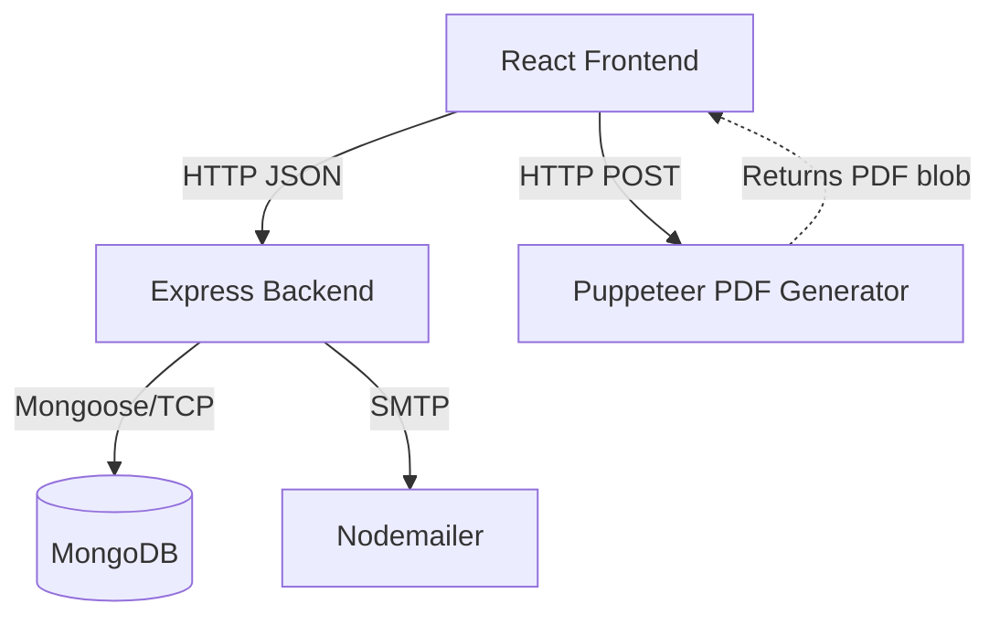
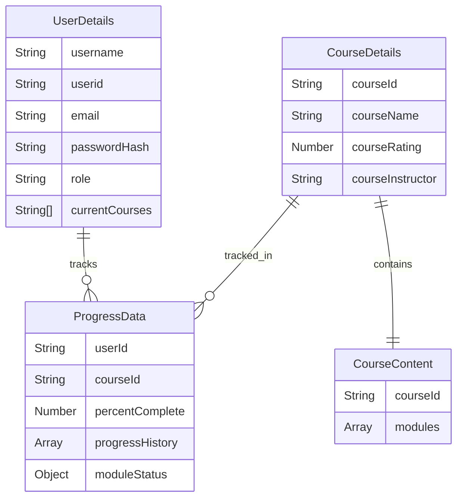

# EduTrack

## What this system is
EduTrack is a full-stack e-learning platform that allows users to explore courses, enroll, track learning progress, take quizzes, and generate certificates. It includes an administrative view for monitoring learners and managing courses.

## Tech stack
* **React** (v19): Frontend UI library.
* **Vite**: Frontend bundler and dev server.
* **TailwindCSS** (v3.4): Frontend styling.
* **Node.js + Express** (v4.21): Backend server framework.
* **MongoDB + Mongoose** (v8.15): Database and ODM.
* **Bcrypt** (v6.0): Password hashing.
* **Nodemailer** (v7.0): Sending OTP emails for authentication.
* **Puppeteer** (v24.10): Generating PDF certificates on the backend.
* **Chart.js & Recharts**: Rendering user progress graphs on the frontend.

## How it works
Users enter the application via the Login/Signup page (`/`), which enforces OTP-based email verification via Nodemailer. Once authenticated, users land on the User Dashboard to browse available courses and continue enrolled ones. Enrolling in a course creates a `ProgressData` record. The user views modules, watches embedded YouTube videos, and submits quiz answers which are validated against `CourseContent`. Completing a module updates the progress matrix. Upon reaching 100%, the frontend requests a dynamically generated PDF certificate from the backend (rendered via Puppeteer).

## Component diagram

## Data model

## API surface
### Authentication (`/api/login`)
* `POST /signup/newuser` - Register a new user.
* `POST /signup/send-otp` - Send verification OTP.
* `POST /existinguser` - Login and get user details.

### User & Courses (`/api/user`)
* `GET /:userid` - Get user's enrolled and available courses.
* `GET /:userid/:courseId` - Get course details and progress.
* `POST /:userid/:courseid/enroll` - Enroll user in a course.
* `PATCH /:userid/:courseId/progress/:moduleNumber/:subModuleNumber` - Mark a submodule as complete.

### Admin (`/api/admin`)
* `GET /:adminid/course/allcourses` - List all courses.
* `GET /:adminid/` - List all users.
* `POST /:adminid/course/addnewcourse` - Create a new course (with modules and quizzes).
* `PUT /:adminid/promote/:userid` - Promote a user to admin.

### Certificates (`/api/certificate`)
* `POST /` - Generate a PDF certificate for a completed course.

## Areas
### Authentication & Users
Handles OTP-based signup, password reset, and session initialization. Passwords are encrypted with bcrypt.

### Course Learning
Manages the display of course contents, embedded video playback, and quiz validation. Progress is stored dynamically in a matrix based on completed modules.

### Admin Dashboard
Provides a view of all learners, their course progress over time (graphed), and tooling to create new courses with structured JSON payloads containing lectures and assignments.

## Setup & running
### Prerequisites
* Node.js installed
* MongoDB database URL
* Gmail app password (for Nodemailer)

### Environment Variables
**Backend (`server/.env`)**:
* `PORT` - Port to run the backend (e.g., 5000).
* `MONGO_URI` - MongoDB connection string.
* `HASH_SALT` - Salt rounds for bcrypt (e.g., 10).
* `USER_EMAIL` - Gmail address for sending OTPs.
* `EMAIL_PASSWORD` - Gmail App Password.

**Frontend (`client/.env`)**:
* `VITE_API_BASE_URL` - Backend API URL (e.g., `http://localhost:5000`).

### Commands
1. Backend: `cd server && npm install && npm start`
2. Frontend: `cd client && npm install && npm run dev`
