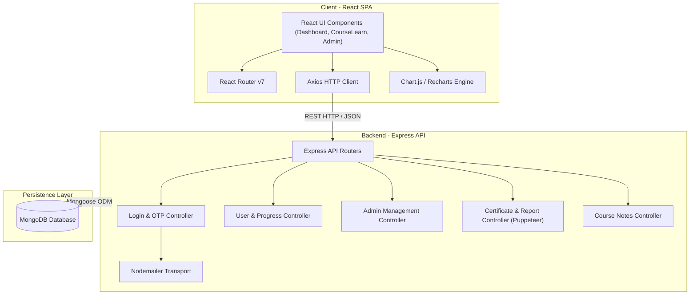
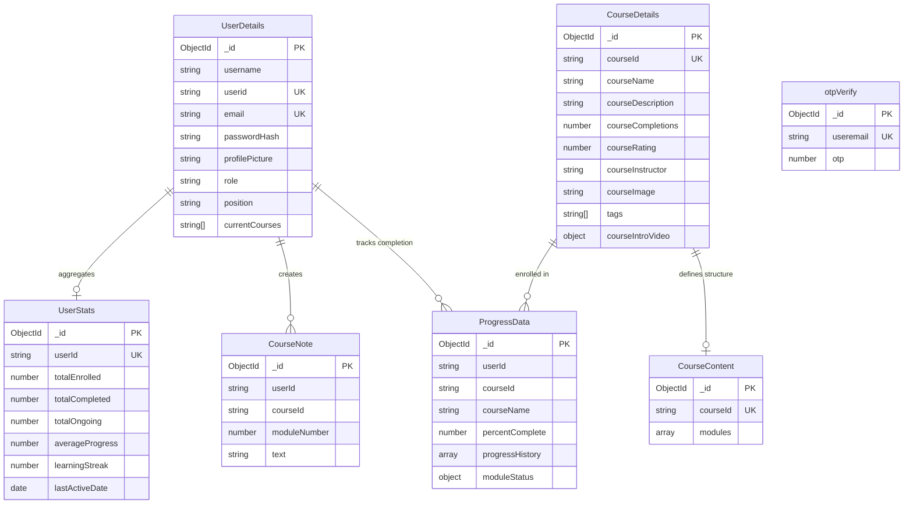
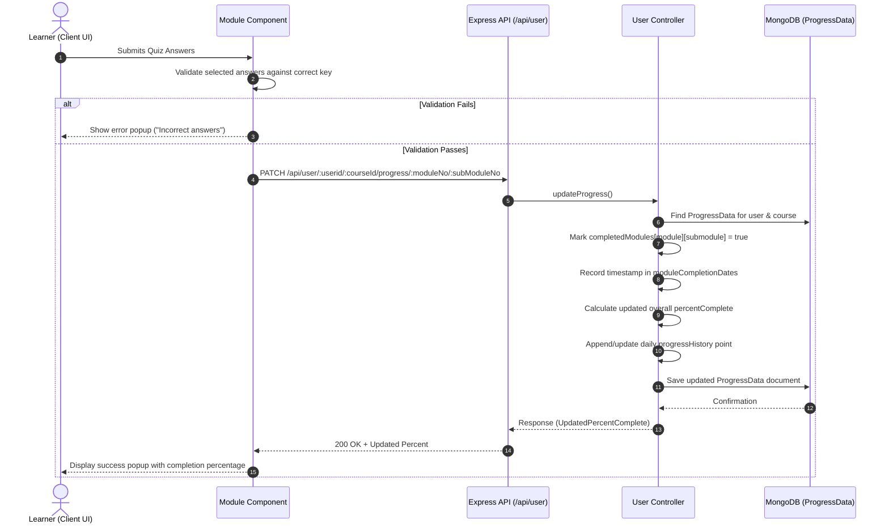

# 📚 EduTrack

EduTrack is a full-stack e-learning platform where users can explore courses, enroll, take quizzes, and track their learning progress — while admins can monitor learners and manage user-course engagement.

---

## 🌍 Live Preview
https://edu-track-flax.vercel.app/

To see the admin view, use:
- **Email**: `backups795@gmail.com`
- **Password**: `1234`
- *Note: This is a dummy user to simulate admin view.*

---

## 1. System Overview

EduTrack is an integrated learning management platform designed to facilitate course discovery, learner progress tracking, interactive quiz evaluation, and admin oversight. The application employs a two-tier user role structure (`user` and `admin`):

- **Learner Workflow**: Authenticate via email/password or OTP verification, browse available courses, enroll in structured multi-module courses, watch video lectures, complete module quizzes, generate monthly progress reports, and download automated PDF certificates upon 100% course completion.
- **Admin Workflow**: Oversee platform users, inspect individual employee progress metrics, track completion percentages over time with dynamic line charts, promote users to admin status, and author new multi-module courses with embedded quiz content.
- **Architecture Pattern**: Decoupled Client-Server Architecture. The frontend is a React Single Page Application (SPA) driven by Vite and React Router v7. The backend is an Express.js REST API using Mongoose for MongoDB persistence, Puppeteer for PDF document compilation, and Nodemailer for transactional email OTP verification.

---

## 2. Technology Stack & Dependencies

| Category | Technology / Library | Purpose in this Project |
| :--- | :--- | :--- |
| **Frontend Core** | React 19, Vite | Client-side UI rendering and fast development bundling |
| **Routing** | React Router v7 | Client-side SPA routing and path parameter handling |
| **HTTP Client** | Axios | Async REST API requests between client and server |
| **Data Visualization**| Chart.js, react-chartjs-2, Recharts | Dynamic line charts for historical learning progress tracking |
| **Icons & UI** | Lucide React, Tailwind CSS | UI iconography and responsive styling |
| **Backend Core** | Node.js, Express.js | Server runtime and RESTful API route handling |
| **Database & ODM** | MongoDB, Mongoose | NoSQL document persistence and schema modelling |
| **Security & Auth** | Bcrypt | Password hashing and salt-based verification |
| **Messaging & OTP** | Nodemailer | Transactional email delivery for signup and password reset OTPs |
| **Document Engine** | Puppeteer | Headless Chrome engine for generating PDF certificates and monthly reports |

---

## 3. High-Level Architecture Diagram



---

## 4. Directory & Module Structure

```
EduTrack/
├── client/                     # Frontend React application (Vite)
│   ├── public/                 # Static assets
│   ├── src/
│   │   ├── assets/             # Images and branding assets
│   │   ├── components/         # Reusable UI components (Navbar, CourseDetails, Module, etc.)
│   │   ├── pages/              # Top-level route pages (Login, UserDashboard, AdminDashboard, etc.)
│   │   ├── styles/             # Dedicated CSS stylesheets per component/page
│   │   ├── App.jsx             # React Router v7 route definitions
│   │   └── main.jsx            # Application entry point
│   ├── package.json            # Client dependencies and scripts
│   └── vite.config.js          # Vite build configuration
└── server/                     # Backend Express application
    ├── controllers/            # Route controllers (admin, user, login, certificate, notes, otpAuth)
    ├── database/               # MongoDB connection logic (connect.js)
    ├── middlewares/            # Custom Express middleware (error-handler, not-found)
    ├── models/                 # Mongoose schemas (UserDetails, CourseDetails, CourseContent, ProgressData, etc.)
    ├── routes/                 # Express route handlers (adminRouter, userRouter, loginRouter, etc.)
    ├── utils/                  # Helper utilities (generateOTP, nodemailer, sendOTP)
    ├── render-postinstall.js   # Build script for Linux Chrome dependency installation
    ├── package.json            # Server dependencies and scripts
    └── server.js               # Express application initialization and startup
```

---

## 5. Data Models & Database Schema



---

## 6. API Surface, Routes & Interfaces

### Authentication & Account Recovery (`/api/login`)
| Method | Endpoint | Handler | Auth / Access | Description |
| :--- | :--- | :--- | :--- | :--- |
| `POST` | `/api/login/existinguser` | `loginValidation` | Public | Authenticate existing user via email/password |
| `POST` | `/api/login/signup/check` | `checkExistingUser` | Public | Verify if user email is already registered |
| `POST` | `/api/login/signup/send-otp` | `sendOTPController` | Public | Generate and email OTP code for signup |
| `POST` | `/api/login/signup/verify-otp` | `verifyOTPController` | Public | Verify OTP code supplied during signup |
| `POST` | `/api/login/signup/newuser` | `signupValidation` | Public | Register new user account with hashed password |
| `POST` | `/api/login/forgot-password/send-otp` | `sendOTPController` | Public | Email OTP code for password reset |
| `POST` | `/api/login/forgot-password/verify-otp` | `verifyOTPController` | Public | Verify password reset OTP code |
| `POST` | `/api/login/forgot-password/reset-password` | `resetUserPassword` | Public | Reset account password with new bcrypt hash |

### Learner Operations (`/api/user`)
| Method | Endpoint | Handler | Auth / Access | Description |
| :--- | :--- | :--- | :--- | :--- |
| `GET` | `/api/user/:userid` | `getAllCourses` | Learner | Retrieve enrolled, available, and completed courses |
| `GET` | `/api/user/:userid/stats` | `getUserStats` | Learner | Calculate/retrieve user learning statistics and streak |
| `GET` | `/api/user/:userid/:courseId` | `getCourseById` | Learner | Get course introduction details and progress status |
| `GET` | `/api/user/:userid/:courseId/module/:moduleNumber/:subModuleNumber` | `getSubModuleByCourseId` | Learner | Fetch submodule video, description, and quiz questions |
| `GET` | `/api/user/:userid/:courseid/progress` | `getProgressMatrixByCourseId` | Learner | Fetch submodule completion boolean matrix |
| `GET` | `/api/user/:userid/data/userinfo` | `getUserInfoByUserId` | Learner | Fetch public profile data for specified user |
| `PATCH` | `/api/user/:userid/:courseId/progress/:moduleNumber/:subModuleNumber` | `updateProgress` | Learner | Mark submodule as complete and update overall course progress |
| `GET` | `/api/user/:userid/course/search` | `searchCourse` | Learner | Search courses matching comma-separated tags |
| `POST` | `/api/user/:userid/:courseid/enroll` | `enrollUserInCourse` | Learner | Enroll user in course and initialize progress record |
| `POST` | `/api/user/:userid/course/:courseid/feedback` | `updateRating` | Learner | Submit star rating and update course average |
| `PATCH` | `/api/user/:userid/user/data/editprofile` | `editProfile` | Learner | Update learner username and profile picture |

### Admin Management (`/api/admin`)
| Method | Endpoint | Handler | Auth / Access | Description |
| :--- | :--- | :--- | :--- | :--- |
| `GET` | `/api/admin/:adminid/course/allcourses` | `getAllCourses` | Admin | Retrieve all courses registered on platform |
| `GET` | `/api/admin/:adminid/` | `getAllUsers` | Admin | List all registered system users |
| `GET` | `/api/admin/:adminid/userdata/:userid` | `getUserById` | Admin | Fetch detailed profile for specified user |
| `GET` | `/api/admin/:adminid/progress/:employeeid` | `getProgressByUserId` | Admin | Fetch course progress records for specific employee |
| `GET` | `/api/admin/:adminid/allusers/:courseId` | `getUserForCourse` | Admin | List all users enrolled in a given course with progress |
| `GET` | `/api/admin/:adminid/courseinfo/:courseId` | `getCourseInfoById` | Admin | Fetch course details and table of contents |
| `PUT` | `/api/admin/:adminid/promote/:userid` | `addNewUser` | Admin | Promote target user role to admin |
| `PATCH` | `/api/admin/:adminid/updateuserrole` | `updateUserRole` | Admin | Update specific user's role |
| `POST` | `/api/admin/:adminid/course/addnewcourse` | `addNewCourse` | Admin | Create new course with modules, videos, and quizzes |
| `PATCH` | `/api/admin/:adminid/user/data/editprofile` | `editProfileAdmin` | Admin | Admin update for user profile attributes |

### Certificates & Reports (`/api/certificate`)
| Method | Endpoint | Handler | Auth / Access | Description |
| :--- | :--- | :--- | :--- | :--- |
| `POST` | `/api/certificate/` | `generateCertificate` | Public / User | Generate PDF course completion certificate using Puppeteer |
| `GET` | `/api/certificate/monthly/:userid` | `generateMonthlyLearningReport` | Rate-Limited | Generate monthly PDF learning report for learner |

### Notes & Metadata (`/api/notes`, `/api/common`)
| Method | Endpoint | Handler | Auth / Access | Description |
| :--- | :--- | :--- | :--- | :--- |
| `GET` | `/api/notes/:userid/:courseId/module/:moduleNumber` | `getNotesByModule` | Learner | Retrieve module notes for user |
| `POST` | `/api/notes/:userid/:courseId/module/:moduleNumber` | `createNote` | Learner | Create new course module note |
| `DELETE` | `/api/notes/:userid/note/:noteId` | `deleteNote` | Learner | Delete specific user note |
| `GET` | `/api/common/profile/role/:userid` | `getRole` | Public | Retrieve system role (`user` or `admin`) for user ID |

---

## 7. Key Data Flows & Sequences

### Quiz Submission & Progress Synchronization



---

## 8. Configuration & Environment Variables

### Server Environment Variables (`server/.env`)
| Variable | Type | Required | Description |
| :--- | :--- | :--- | :--- |
| `PORT` | Number | No | Port for Express API server (default: `5000` or `3000`) |
| `MONGO_URI` | String | Yes | MongoDB connection URI |
| `HASH_SALT` | Number | Yes | Salt rounds for Bcrypt password hashing (e.g. `10`) |
| `USER_EMAIL` | String | Yes | Gmail address used by Nodemailer to send OTP emails |
| `EMAIL_PASSWORD` | String | Yes | Gmail App Password for Nodemailer authentication |

### Client Environment Variables (`client/.env`)
| Variable | Type | Required | Description |
| :--- | :--- | :--- | :--- |
| `VITE_API_BASE_URL` | String | Yes | Base URL for Express backend API (e.g. `http://localhost:5000`) |

---

## 🛠️ Setup Instructions

- Clone the repository:
```bash
git clone https://github.com/abdul8704/EduTrack.git
cd EduTrack
```

- Install root dependencies (if applicable) and workspace modules:
```bash
cd server && npm install
cd ../client && npm install
```

- Setup environment variables:

Create a `.env` file in the `server` directory:
```env
PORT=5000
MONGO_URI=your_mongo_uri_here
HASH_SALT=10
USER_EMAIL=your_email_here
EMAIL_PASSWORD=your_email_app_password
```

Create a `.env` file in the `client` directory:
```env
VITE_API_BASE_URL=http://localhost:5000
```

- Run the backend server:
```bash
cd server
npm run start
```

- Run the frontend client:
```bash
cd client
npm run dev
```
