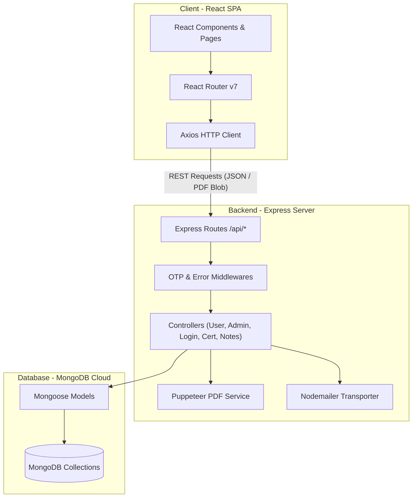
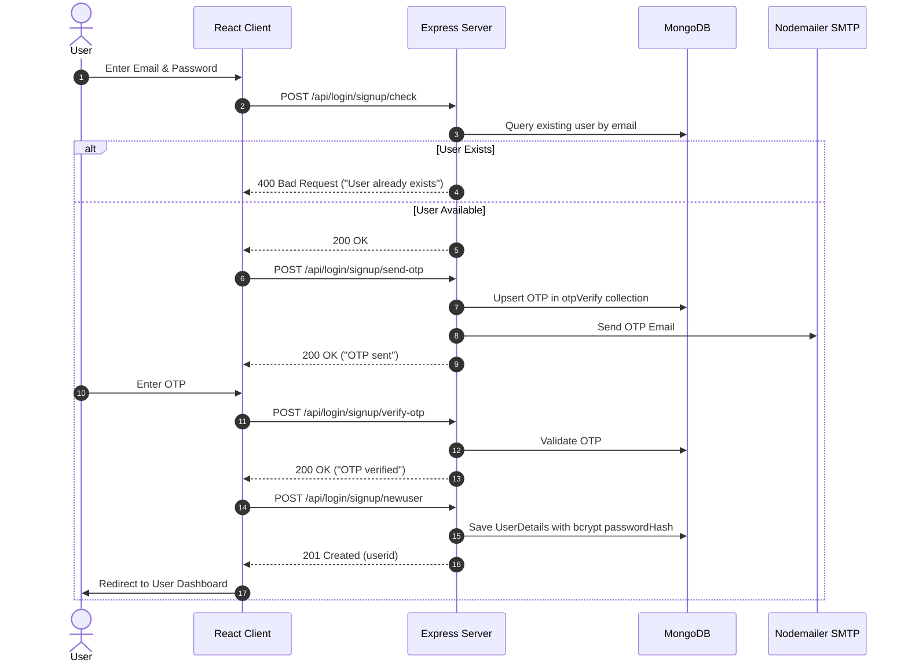
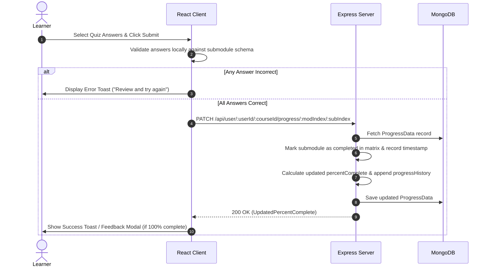

# 📚 EduTrack - System Architecture & Technical Documentation

EduTrack is a full-stack e-learning platform where users can explore courses, enroll, take quizzes, and track their learning progress — while admins can monitor learners, manage user-course engagement, and add new course content.

---

## 🌍 Live Preview & Demo Credentials

* **Live Preview:** [https://edu-track-flax.vercel.app/](https://edu-track-flax.vercel.app/)
* **Admin Demo Credentials:**
  * **Email:** `backups795@gmail.com`
  * **Password:** `1234`
  * *Note: Use these credentials to test the admin features.*

---

## 1. System Overview

### High-Level Purpose
EduTrack provides a learning ecosystem featuring structured course modules, submodule video lectures, interactive quiz validation, learner progress tracking over time, and automated PDF certificate generation. For administrators, it offers employee progress tracking, course management, dynamic course creation, and learner promotion tools.

### Core Design Pattern
EduTrack follows a **Layered Client-Server Architecture**:
* **Frontend:** Component-Driven Single Page Application (SPA) built with React and Vite, using React Router v7 for client-side routing, Axios for HTTP communication, and Chart.js/Recharts for visual analytics.
* **Backend:** RESTful API server built on Node.js and Express.js, organized into explicit Controllers, Routes, Middlewares, and Mongoose Database Models.
* **Persistence:** MongoDB database operated via Mongoose ODM using document schemas with embedded sub-documents and relational keys.

---

## 2. Technology Stack & Dependencies

| Category | Technology / Library | Version | Purpose in this Project |
| :--- | :--- | :--- | :--- |
| **Frontend Framework** | React | ^19.1.0 | UI rendering and client-side state management |
| **Build Tool & Bundler** | Vite | ^6.3.5 | Fast HMR dev server and frontend production builder |
| **Routing** | React Router DOM | ^7.6.1 | Client-side page navigation and URL parameter mapping |
| **Styling** | Tailwind CSS / PostCSS | ^3.4.17 | Utility-first CSS styling and responsive layouts |
| **Data Visualization** | Chart.js & react-chartjs-2 / Recharts | ^4.5.0 / ^3.2.1 | Rendering learner progress-over-time trend graphs |
| **Icons** | Lucide React | ^0.511.0 | Dashboard and UI action iconography |
| **HTTP Client** | Axios | ^1.9.0 | Client-to-Server REST API request handler |
| **Backend Runtime** | Node.js / Express | ^4.21.2 | Server framework hosting RESTful API endpoints |
| **Database ODM** | Mongoose | ^8.15.0 | MongoDB object modeling and document schema definition |
| **Authentication & Hash** | bcrypt | ^6.0.0 | Salted password hashing for user authentication |
| **Mailing / OTP** | Nodemailer | ^7.0.3 | SMTP integration for sending email OTP verification codes |
| **PDF Generation** | Puppeteer | ^24.10.0 | Headless Chromium browser rendering for generating certificates and monthly learning reports |

---

## 3. High-Level Architecture Diagram



---

## 4. Directory & Module Structure

```text
EduTrack/
├── client/                       # React Frontend Application
│   ├── src/
│   │   ├── assets/               # Branding assets and logos
│   │   ├── components/           # Reusable UI components
│   │   │   ├── AdminAvailableCourse.jsx  # Admin course collection view
│   │   │   ├── CourseDetails.jsx         # Course intro card & cert action
│   │   │   ├── CourseNavbar.jsx          # Learning page sidebar navigation
│   │   │   ├── EditProfile.jsx           # User/Admin profile edit modal
│   │   │   ├── Module.jsx                # Video player & quiz form handler
│   │   │   ├── Navbar.jsx                # Global navigation bar & search input
│   │   │   ├── ProfileCard.jsx           # Employee overview cards
│   │   │   └── UserProgressChartJS.jsx   # Line chart for learner progress
│   │   ├── pages/                # Route-level view pages
│   │   │   ├── AddCourse.jsx             # Course creation form for admins
│   │   │   ├── AdminDashboard.jsx        # Admin home view & navigation
│   │   │   ├── CourseDeets.jsx           # Admin course enrollment view
│   │   │   ├── CourseIntro.jsx           # Course overview and enrollment page
│   │   │   ├── CourseLearn.jsx           # Submodule learning & quiz player
│   │   │   ├── EmpProgress.jsx           # Admin view of employee course progress
│   │   │   ├── Login.jsx                 # Auth page (Login/Signup/OTP/Forgot Password)
│   │   │   ├── Profile.jsx               # User profile & certificate download
│   │   │   └── UserDashboard.jsx         # Learner course dashboard
│   │   ├── styles/               # CSS stylesheet modules
│   │   ├── App.jsx               # React Router route definitions
│   │   └── main.jsx              # Entry point
│   ├── package.json
│   └── vite.config.js            # Vite build setup
└── server/                       # Node.js Express Backend
    ├── controllers/              # Business logic handlers
    │   ├── admin.js              # Admin user & course management logic
    │   ├── certificate.js        # Puppeteer PDF generation (certs & monthly reports)
    │   ├── login.js              # User auth, registration, and password reset
    │   ├── notes.js              # User module notes CRUD operations
    │   ├── otpAuth.js            # OTP generation and email dispatch
    │   └── user.js               # Learner course operations & progress calculation
    ├── database/                 # MongoDB connection initialization
    │   └── connect.js
    ├── middlewares/              # Express custom middlewares
    │   ├── error-handler.js      # Global exception handler
    │   └── not-found.js          # 404 fallback handler
    ├── models/                   # Mongoose data models
    │   ├── authOTP.js            # Temporary OTP storage schema
    │   ├── courseContent.js      # Modules, submodules & quiz schema
    │   ├── courseDetails.js      # Metadata for published courses
    │   ├── courseNote.js         # Learner notes schema
    │   ├── courseProgress.js     # Progress matrix & completion date tracking
    │   ├── userDetails.js        # User profile & credentials schema
    │   └── userStats.js          # Aggregated user metrics schema
    ├── routes/                   # Express route definitions
    │   ├── adminRouter.js        # Admin endpoints (/api/admin)
    │   ├── certificateRouter.js  # Certificate PDF endpoints (/api/certificate)
    │   ├── loginRouter.js        # Auth endpoints (/api/login)
    │   ├── notesRouter.js        # Notes endpoints (/api/notes)
    │   └── userRouter.js        # User endpoints (/api/user)
    ├── utils/                    # Utility helpers (Nodemailer, OTP generator)
    ├── render-postinstall.js     # Cloud post-install script for Chromium Puppeteer
    ├── package.json
    └── server.js                 # Express server bootstrap & MongoDB connection
```

---

## 5. Data Models & Database Schema

```mermaid
erDiagram
    UserDetails ||--o{ ProgressData : "tracks completion in"
    UserDetails ||--o{ CourseNote : "creates"
    UserDetails ||--o1 UserStats : "has analytics"
    CourseDetails ||--o1 CourseContent : "defines structure"
    CourseDetails ||--o{ ProgressData : "referenced by"

    UserDetails {
        ObjectId _id
        string username
        string userid PK, UK
        string email UK
        string passwordHash
        string profilePicture
        string role
        string position
        string[] currentCourses
    }

    CourseDetails {
        ObjectId _id
        string courseId PK, UK
        string courseName
        string courseDescription
        number courseCompletions
        number courseRating
        string courseInstructor
        string courseImage
        string[] tags
    }

    CourseContent {
        ObjectId _id
        string courseId FK, UK
        Array modules
    }

    ProgressData {
        ObjectId _id
        string userId FK
        string courseId FK
        string courseName
        number percentComplete
        Array progressHistory
        Object moduleStatus
    }

    CourseNote {
        ObjectId _id
        string userId FK
        string courseId FK
        number moduleNumber
        string text
    }

    UserStats {
        ObjectId _id
        string userId FK, UK
        number totalEnrolled
        number totalCompleted
        number totalOngoing
        number averageProgress
        number learningStreak
        date lastActiveDate
    }

    otpVerify {
        ObjectId _id
        string useremail UK
        number otp
    }
```

---

## 6. API Surface, Routes & Interfaces

### Authentication Routes (`/api/login`)
| Method | Endpoint | Handler | Description |
| :--- | :--- | :--- | :--- |
| `POST` | `/signup/check` | `checkExistingUser` | Check if an email is already registered |
| `POST` | `/signup/send-otp` | `sendOTPController` | Generate & email OTP for account signup |
| `POST` | `/signup/verify-otp` | `verifyOTPController` | Verify the OTP entered by user |
| `POST` | `/signup/newuser` | `signupValidation` | Create new user document with bcrypt-hashed password |
| `POST` | `/existinguser` | `loginValidation` | Authenticate existing user credentials |
| `POST` | `/forgot-password/send-otp` | `sendOTPController` | Dispatch OTP for password reset |
| `POST` | `/forgot-password/verify-otp` | `verifyOTPController` | Verify password reset OTP |
| `POST` | `/forgot-password/reset-password` | `resetUserPassword` | Update user password in DB |

### Learner Routes (`/api/user`)
| Method | Endpoint | Handler | Description |
| :--- | :--- | :--- | :--- |
| `GET` | `/:userid` | `getAllCourses` | Retrieve user's enrolled, available, and completed courses |
| `GET` | `/:userid/stats` | `getUserStats` | Fetch user learning streak and average completion metrics |
| `GET` | `/:userid/data/userinfo` | `getUserInfoByUserId` | Retrieve user profile information |
| `GET` | `/:userid/:courseId` | `getCourseById` | Fetch course details, user completion status, and table of contents |
| `GET` | `/:userid/:courseId/module/:mNo/:sNo` | `getSubModuleByCourseId` | Get submodule content (video URL, description, quiz) |
| `GET` | `/:userid/:courseid/progress` | `getProgressMatrixByCourseId` | Get user's submodule completion matrix |
| `POST` | `/:userid/:courseid/enroll` | `enrollUserInCourse` | Enroll user in a course and initialize progress tracking |
| `PATCH` | `/:userid/:courseId/progress/:mNo/:sNo` | `updateProgress` | Mark submodule completed upon quiz validation & recalculate % |
| `GET` | `/:userid/course/search` | `searchCourse` | Query courses filtered by tags |
| `POST` | `/:userid/course/:courseid/feedback` | `updateRating` | Submit rating feedback for a completed course |
| `PATCH` | `/:userid/user/data/editprofile` | `editProfile` | Update user profile details (username, profile picture) |

### Admin Routes (`/api/admin`)
| Method | Endpoint | Handler | Description |
| :--- | :--- | :--- | :--- |
| `GET` | `/:adminid/` | `getAllUsers` | Get list of all registered users |
| `GET` | `/:adminid/userdata/:userid` | `getUserById` | Fetch specific user details |
| `GET` | `/:adminid/course/allcourses` | `getAllCourses` | List all available courses in system |
| `GET` | `/:adminid/courseinfo/:courseId` | `getCourseInfoById` | Get course metadata and table of contents |
| `GET` | `/:adminid/allusers/:courseId` | `getUserForCourse` | Get all users enrolled in a specific course with progress history |
| `GET` | `/:adminid/progress/:employeeid` | `getProgressByUserId` | Get progress across all courses for a specific user |
| `POST` | `/:adminid/course/addnewcourse` | `addNewCourse` | Create a new course with modules, lectures, and quizzes |
| `PUT` | `/:adminid/promote/:userid` | `addNewUser` | Promote a user to admin role |
| `PATCH` | `/:adminid/updateuserrole` | `updateUserRole` | Change user role |
| `PATCH` | `/:adminid/user/data/editprofile` | `editProfileAdmin` | Admin update for user profile fields |

### Certificate & Report Routes (`/api/certificate`)
| Method | Endpoint | Handler | Description |
| :--- | :--- | :--- | :--- |
| `POST` | `/` | `generateCertificate` | Render landscape A4 course completion PDF certificate via Puppeteer |
| `GET` | `/monthly/:userid` | `generateMonthlyLearningReport` | Generate rate-limited monthly learning summary PDF |

### Notes Routes (`/api/notes`)
| Method | Endpoint | Handler | Description |
| :--- | :--- | :--- | :--- |
| `GET` | `/:userid/:courseId/module/:moduleNumber` | `getNotesByModule` | Get learner notes for a module |
| `POST` | `/:userid/:courseId/module/:moduleNumber` | `createNote` | Save a new note |
| `DELETE` | `/:userid/note/:noteId` | `deleteNote` | Delete a note |

---

## 7. Key Data Flows & Sequences

### User Signup & OTP Verification



### Course Progress & Quiz Completion



---

## 8. Configuration & Environment Variables

### Server Environment Variables (`server/.env`)
| Variable Name | Required | Description |
| :--- | :--- | :--- |
| `PORT` | Optional (Default: 3000/5000) | Express server listening port |
| `MONGO_URI` | **Yes** | MongoDB connection string |
| `HASH_SALT` | **Yes** | Salt rounds for `bcrypt` password hashing (e.g., `10`) |
| `USER_EMAIL` | **Yes** | Gmail / SMTP email address for Nodemailer OTP delivery |
| `EMAIL_PASSWORD` | **Yes** | App password for SMTP authentication |

### Client Environment Variables (`client/.env`)
| Variable Name | Required | Description |
| :--- | :--- | :--- |
| `VITE_API_BASE_URL` | **Yes** | Base URL for Express backend API (e.g., `http://localhost:5000` or production backend URL) |

---

## 🛠️ Setup Instructions

1. **Clone the repository:**
   ```bash
   git clone https://github.com/abdul8704/EduTrack.git
   cd EduTrack
   ```

2. **Install Server Dependencies:**
   ```bash
   cd server
   npm install
   ```

3. **Install Client Dependencies:**
   ```bash
   cd ../client
   npm install
   ```

4. **Configure Environment Variables:**
   Create a `.env` file inside `server/`:
   ```env
   PORT=5000
   MONGO_URI=your_mongo_uri_here
   HASH_SALT=10
   USER_EMAIL=your_email_here
   EMAIL_PASSWORD=your_email_app_password
   ```
   Create a `.env` file inside `client/`:
   ```env
   VITE_API_BASE_URL=http://localhost:5000
   ```

5. **Run the Application:**
   Start the backend server:
   ```bash
   cd server
   npm run start
   ```
   Start the Vite frontend development server:
   ```bash
   cd client
   npm run dev
   ```
