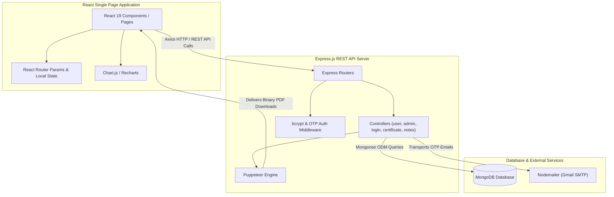
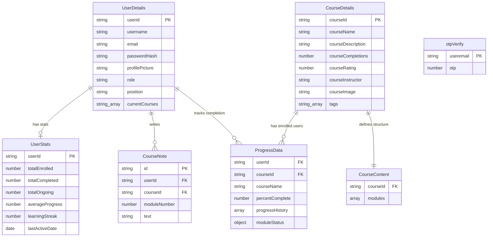
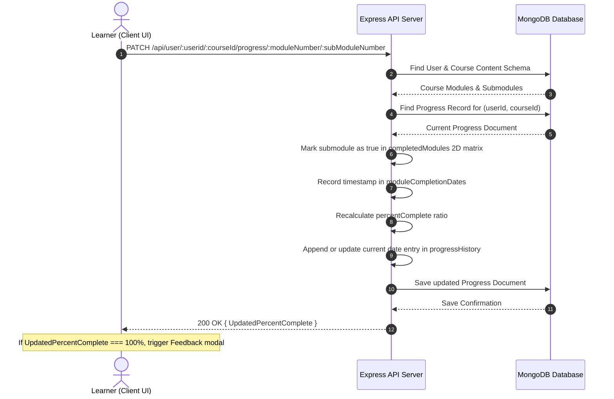

# 📚 EduTrack

EduTrack is a full-stack e-learning and course management platform built with React and Node.js. It enables users to browse courses, enroll, complete multi-module lectures with interactive quizzes, track visual learning progress, and download PDF certificates upon completion. Admins can manage courses, track individual employee learning metrics, and oversee user enrollment.

---

## 🌍 Live Preview & Admin Access

- **Live App**: [https://edu-track-flax.vercel.app/](https://edu-track-flax.vercel.app/)
- **Demo Admin Credentials**:
  - **Email**: `backups795@gmail.com`
  - **Password**: `1234`
  - *Note: Demo admin account used to simulate admin capabilities.*

---

## 1. System Overview

### High-Level Purpose
EduTrack addresses corporate and individual online learning requirements by offering interactive course progression, tracking quiz completions via progress matrices, generating monthly learning reports, and delivering downloadable PDF certificates of completion.

### Core Design Pattern
- **Client-Server Architecture**: Monorepo split between a Vite-powered React Single Page Application (`client`) and an Express.js REST API server (`server`).
- **MVC & Controller Pattern**: Express backend follows a modular Controller-Route-Model separation backed by Mongoose schemas.
- **Matrix-Based Progress Tracking**: Module and submodule completion is tracked via boolean 2D matrices per user and course, enabling precise completion percentage calculations and chronological history tracking.

---

## 2. Technology Stack & Dependencies

| Category | Technology / Library | Purpose in this Project |
| :--- | :--- | :--- |
| **Frontend Framework** | React 19 + Vite | UI library and fast development bundler |
| **Routing & Client Nav** | React Router DOM v7 | Client-side page navigation and URL parameter management |
| **Data Visualization** | Chart.js / react-chartjs-2, Recharts | Visualizing user learning progress history over time |
| **Styling & UI** | Tailwind CSS + Custom CSS | Layouts, animations, popup alerts, and responsive viewports |
| **HTTP Client** | Axios | Async HTTP calls to Express backend endpoints |
| **Backend Runtime** | Node.js + Express.js v4 | Server runtime and RESTful API framework |
| **Database & ODM** | MongoDB + Mongoose v8 | Document database and object data modeling |
| **Authentication & Security**| bcrypt | Password hashing with configurable salt rounds |
| **Email & Verification** | Nodemailer | Sending OTP verification codes for email verification and password resets |
| **Document Generation** | Puppeteer | Headless Chrome engine for rendering HTML templates into PDF certificates and monthly reports |

---

## 3. High-Level Architecture Diagram



---

## 4. Directory & Module Structure

```
EduTrack/
├── client/                     # Frontend Application (React + Vite)
│   ├── public/                 # Static public assets
│   ├── src/
│   │   ├── assets/             # Images and logos
│   │   ├── components/         # Reusable UI elements (Navbar, CourseDetails, Module, Cards, Graphs)
│   │   ├── pages/              # Route view components (Login, Dashboards, CourseIntro, Learn, Profile, etc.)
│   │   ├── styles/             # Dedicated CSS stylesheets for pages and components
│   │   ├── App.jsx             # React Router route definitions
│   │   └── main.jsx            # Application entrypoint
│   ├── package.json            # Client dependencies and scripts
│   └── vite.config.js          # Vite bundler configuration
└── server/                     # Backend Application (Express + Node.js)
    ├── controllers/            # Request handlers (admin, user, login, certificate, notes, etc.)
    ├── database/               # Database connection setup (connect.js)
    ├── middlewares/            # Global error handling and route fallbacks
    ├── models/                 # Mongoose schema definitions (User, Course, Content, Progress, Note, Stats)
    ├── routes/                 # API route declarations
    ├── utils/                  # OTP generator and Nodemailer transports
    ├── render-postinstall.js   # Script to install Chromium for Puppeteer on Linux environments
    ├── server.js               # Server entrypoint and express initialization
    └── package.json            # Server dependencies
```

---

## 5. Data Models & Database Schema



---

## 6. API Surface, Routes & Interfaces

### Authentication & Account Routes (`/api/login`)
| Method | Endpoint | Handler | Auth / Role | Description |
| :--- | :--- | :--- | :--- | :--- |
| `POST` | `/api/login/existinguser` | `loginValidation` | Public | Authenticates credentials and returns user details |
| `POST` | `/api/login/signup/check` | `checkExistingUser` | Public | Checks if an email is already registered |
| `POST` | `/api/login/signup/send-otp` | `sendOTPController` | Public | Generates and emails a 6-digit verification OTP |
| `POST` | `/api/login/signup/verify-otp` | `verifyOTPController` | Public | Verifies signup OTP code |
| `POST` | `/api/login/signup/newuser` | `signupValidation` | Public | Hashes password and creates a new user |
| `POST` | `/api/login/forgot-password/send-otp` | `sendOTPController` | Public | Sends password reset OTP |
| `POST` | `/api/login/forgot-password/verify-otp` | `verifyOTPController` | Public | Verifies password reset OTP |
| `POST` | `/api/login/forgot-password/reset-password` | `resetUserPassword` | Public | Resets user password to new value |

### User & Course Interaction Routes (`/api/user`)
| Method | Endpoint | Handler | Auth / Role | Description |
| :--- | :--- | :--- | :--- | :--- |
| `GET` | `/api/user/:userid` | `getAllCourses` | User | Gets enrolled, completed, and available courses |
| `GET` | `/api/user/:userid/stats` | `getUserStats` | User | Computes and returns user learning stats and streaks |
| `GET` | `/api/user/:userid/:courseId` | `getCourseById` | User | Gets course intro details and overview contents |
| `GET` | `/api/user/:userid/:courseId/module/:moduleNumber/:subModuleNumber` | `getSubModuleByCourseId` | User | Fetches submodule video, description, and quiz |
| `GET` | `/api/user/:userid/:courseid/progress` | `getProgressMatrixByCourseId` | User | Retrieves user's completion matrix for a course |
| `GET` | `/api/user/:userid/data/userinfo` | `getUserInfoByUserId` | User | Gets public profile information for a user |
| `POST` | `/api/user/:userid/:courseid/enroll` | `enrollUserInCourse` | User | Enrolls a user in a course and initializes progress |
| `PATCH`| `/api/user/:userid/:courseId/progress/:moduleNumber/:subModuleNumber` | `updateProgress` | User | Updates submodule progress, recalculates completion % |
| `GET` | `/api/user/:userid/course/search` | `searchCourse` | User | Searches courses matching tag query string |
| `POST` | `/api/user/:userid/course/:courseid/feedback` | `updateRating` | User | Submits course rating feedback |
| `PATCH`| `/api/user/:userid/user/data/editprofile` | `editProfile` | User | Updates username and profile picture |

### Admin Management Routes (`/api/admin`)
| Method | Endpoint | Handler | Auth / Role | Description |
| :--- | :--- | :--- | :--- | :--- |
| `GET` | `/api/admin/:adminid/` | `getAllUsers` | Admin | Lists all registered users |
| `GET` | `/api/admin/:adminid/userdata/:userid` | `getUserById` | Admin | Gets detailed user profile |
| `GET` | `/api/admin/:adminid/course/allcourses` | `getAllCourses` | Admin | Gets overview list of all courses |
| `GET` | `/api/admin/:adminid/courseinfo/:courseId` | `getCourseInfoById` | Admin | Gets course info and table of contents |
| `GET` | `/api/admin/:adminid/allusers/:courseId` | `getUserForCourse` | Admin | Gets all enrolled users and completion rates for a course |
| `GET` | `/api/admin/:adminid/progress/:employeeid` | `getProgressByUserId` | Admin | Gets specific employee's progress across courses |
| `PUT` | `/api/admin/:adminid/promote/:userid` | `addNewUser` | Admin | Promotes target user to admin role |
| `PATCH`| `/api/admin/:adminid/updateuserrole` | `updateUserRole` | Admin | Updates user role explicitly |
| `POST` | `/api/admin/:adminid/course/addnewcourse` | `addNewCourse` | Admin | Creates a new course along with its full content tree |
| `PATCH`| `/api/admin/:adminid/user/data/editprofile` | `editProfileAdmin` | Admin | Updates user details from admin console |

### Document Generation Routes (`/api/certificate`)
| Method | Endpoint | Handler | Description |
| :--- | :--- | :--- | :--- |
| `POST` | `/api/certificate/` | `generateCertificate` | Generates a landscape A4 course completion PDF certificate via Puppeteer |
| `GET` | `/api/certificate/monthly/:userid` | `generateMonthlyLearningReport` | Generates a monthly summary PDF report of completed modules/courses |

---

## 7. Key Data Flows & Sequences

### Learning Submodule Quiz Submission & Progress Matrix Update



---

## 8. Configuration & Environment Variables

### Server Environment Variables (`server/.env`)

| Variable Name | Purpose | Example Value |
| :--- | :--- | :--- |
| `PORT` | Node.js Express server port | `5000` |
| `MONGO_URI` | MongoDB Connection String URI | `mongodb+srv://<user>:<password>@cluster.mongodb.net/edutrack` |
| `HASH_SALT` | Salt rounds used by `bcrypt` for password hashing | `10` |
| `USER_EMAIL` | Nodemailer sender Gmail account | `your_email@gmail.com` |
| `EMAIL_PASSWORD` | App-specific password for Nodemailer SMTP authentication | `your_app_password` |

### Client Environment Variables (`client/.env`)

| Variable Name | Purpose | Example Value |
| :--- | :--- | :--- |
| `VITE_API_BASE_URL` | Base URL for server API endpoints | `http://localhost:5000` |

---

## 🛠️ Setup Instructions

1. **Clone the repository**:
   ```bash
   git clone https://github.com/abdul8704/EduTrack.git
   cd EduTrack
   ```

2. **Setup Server**:
   ```bash
   cd server
   npm install
   # Create .env file with PORT, MONGO_URI, HASH_SALT, USER_EMAIL, EMAIL_PASSWORD
   npm run start
   ```

3. **Setup Client**:
   ```bash
   cd ../client
   npm install
   # Create .env file with VITE_API_BASE_URL
   npm run dev
   ```