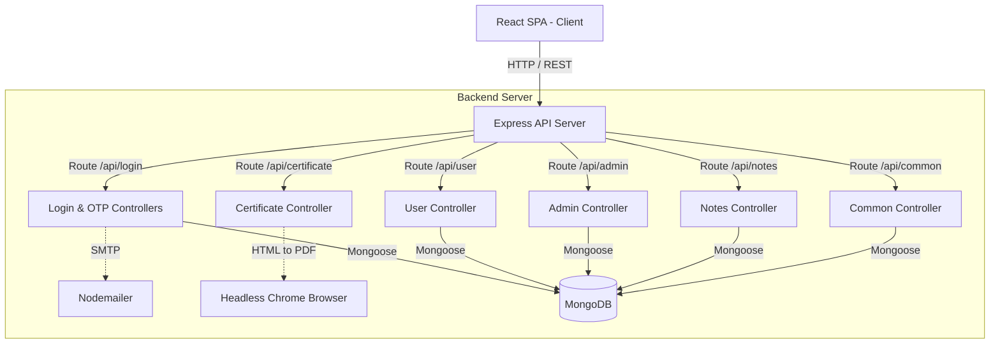
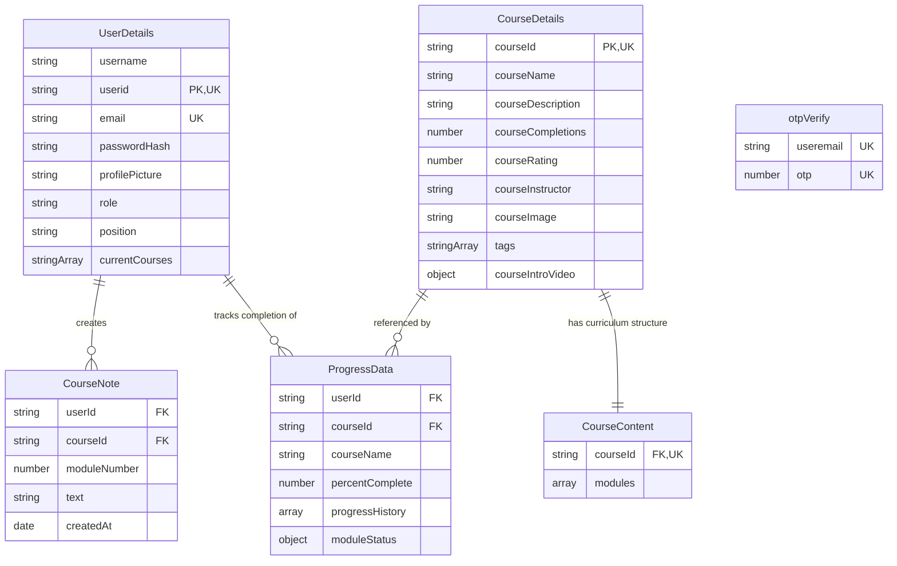

# EduTrack

## What this system is
EduTrack is a full-stack e-learning platform that allows learners to explore courses, enroll, complete modules via interactive quizzes, record custom notes, view completion progress over time, and download PDF certificates as well as monthly learning report PDFs. Administrators can manage courses, view registered users, inspect individual user learning histories, promote users to admin status, and edit user profile details.

## Tech stack
- **React** (v19.1.0): Frontend user interface library.
- **Vite** (v6.3.5): Development server and build tool.
- **react-router-dom** (v7.6.1): Client-side single-page application routing.
- **axios** (v1.9.0): HTTP client for sending requests between frontend and REST API.
- **Chart.js** (v4.5.0) / **react-chartjs-2** (v5.3.0) / **recharts** (v3.2.1): Data visualization libraries for progress time-series charts.
- **lucide-react** (v0.511.0): Icon library for UI elements.
- **Express** (v4.21.2): Web application framework for serving REST API endpoints.
- **Mongoose** (v8.15.0): Object Data Modeling (ODM) framework for MongoDB persistence.
- **bcrypt** (v6.0.0): Hashing library for password security.
- **nodemailer** (v7.0.3): Mail dispatch library for delivering OTP verification emails.
- **puppeteer** (v24.10.0): Headless Chrome API for generating downloadable PDF certificates and monthly learning reports.
- **cors** (v2.8.5): Cross-origin resource sharing middleware.
- **dotenv** (v16.5.0): Environment variable loader.
- **express-async-errors** (v3.1.1): Async error-handling wrapper for Express routes.

## How it works
The system operates as a single-page application (SPA) backed by an Express REST API. The client entry point is `client/src/main.jsx`, which mounts `App.jsx` with routes for user dashboards, course intros, module learning environments, user profiles, and admin management panels.

The server entry point is `server/server.js`, which connects to MongoDB via `connectDB` and mounts REST routes at `/api/login`, `/api/user`, `/api/admin`, `/api/certificate`, `/api/notes`, and `/api/common`.

When a user submits quiz answers for a submodule in `client/src/components/Module.jsx`, the frontend issues a `PATCH` request to `/api/user/:userid/:courseId/progress/:moduleNumber/:subModuleNumber`. The backend updates the user's `ProgressData` document, recalculating overall course completion percentage and logging completion timestamps and daily progress data points. Users can generate an official course completion PDF certificate or request a monthly learning report PDF via `/api/certificate/monthly/:userid`, which Puppeteer renders and returns as a binary PDF blob.

## Component diagram


## Data model


## API surface

### Authentication & Passwords (`/api/login`)
- `POST /api/login/signup/newuser` - Create a new user account [server/routes/loginRouter.js:10]
- `POST /api/login/signup/check` - Check if a user email already exists [server/routes/loginRouter.js:11]
- `POST /api/login/signup/send-otp` - Send signup OTP email [server/routes/loginRouter.js:13]
- `POST /api/login/signup/verify-otp` - Verify signup OTP [server/routes/loginRouter.js:14]
- `POST /api/login/existinguser` - Authenticate existing user with email and password [server/routes/loginRouter.js:15]
- `POST /api/login/forgot-password/send-otp` - Send password reset OTP [server/routes/loginRouter.js:17]
- `POST /api/login/forgot-password/verify-otp` - Verify password reset OTP [server/routes/loginRouter.js:18]
- `POST /api/login/forgot-password/reset-password` - Reset user password [server/routes/loginRouter.js:19]

### Learner Actions (`/api/user`)
- `GET /api/user/:userid` - Get categorized user courses (enrolled, available, completed) [server/routes/userRouter.js:5]
- `GET /api/user/:userid/:courseId` - Get course details and progress [server/routes/userRouter.js:6]
- `GET /api/user/:userid/:courseId/module/:moduleNumber/:subModuleNumber` - Get submodule content and quiz [server/routes/userRouter.js:7]
- `GET /api/user/:userid/:courseid/progress` - Get user submodule progress matrix [server/routes/userRouter.js:11]
- `GET /api/user/:userid/data/userinfo` - Fetch public user info [server/routes/userRouter.js:15]
- `PATCH /api/user/:userid/:courseId/progress/:moduleNumber/:subModuleNumber` - Update submodule progress [server/routes/userRouter.js:16]
- `GET /api/user/:userid/course/search` - Search courses by tags [server/routes/userRouter.js:20]
- `POST /api/user/:userid/:courseid/enroll` - Enroll user in a course [server/routes/userRouter.js:21]
- `POST /api/user/:userid/course/:courseid/feedback` - Submit course rating feedback [server/routes/userRouter.js:22]
- `PATCH /api/user/:userid/user/data/editprofile` - Update learner profile details [server/routes/userRouter.js:23]

### Admin Management (`/api/admin`)
- `GET /api/admin/:adminid/userdata/:userid` - Fetch specific user details (Admin required) [server/routes/adminRouter.js:6]
- `GET /api/admin/:adminid/courseinfo/:courseId` - Fetch course details and table of contents (Admin required) [server/routes/adminRouter.js:7]
- `GET /api/admin/:adminid/` - Fetch all users (Admin required) [server/routes/adminRouter.js:8]
- `GET /api/admin/:adminid/allusers/:courseId` - Get enrolled users for a course (Admin required) [server/routes/adminRouter.js:9]
- `GET /api/admin/:adminid/course/allcourses` - Get all available courses (Admin required) [server/routes/adminRouter.js:10]
- `PUT /api/admin/:adminid/promote/:userid` - Promote a user to admin (Admin required) [server/routes/adminRouter.js:11]
- `GET /api/admin/:adminid/progress/:employeeid` - Get progress for an employee across courses (Admin required) [server/routes/adminRouter.js:12]
- `PATCH /api/admin/:adminid/updateuserrole` - Update user role (Admin required) [server/routes/adminRouter.js:16]
- `POST /api/admin/:adminid/course/addnewcourse` - Add new course with modules and quizzes (Admin required) [server/routes/adminRouter.js:17]
- `PATCH /api/admin/:adminid/user/data/editprofile` - Edit user profile from admin panel (Admin required) [server/routes/adminRouter.js:18]

### Certificates & Reports (`/api/certificate`)
- `POST /api/certificate/` - Generate downloadable A4 course completion PDF certificate [server/routes/certificateRouter.js:31]
- `GET /api/certificate/monthly/:userid` - Generate downloadable monthly learning report PDF with rate limiting [server/routes/certificateRouter.js:32]

### Course Notes (`/api/notes`)
- `GET /api/notes/:userid/:courseId/module/:moduleNumber` - Fetch module notes for learner [server/routes/notesRouter.js:5]
- `POST /api/notes/:userid/:courseId/module/:moduleNumber` - Create a new module note [server/routes/notesRouter.js:9]
- `DELETE /api/notes/:userid/note/:noteId` - Delete a specific module note [server/routes/notesRouter.js:13]

### Common (`/api/common`)
- `GET /api/common/profile/role/:userid` - Retrieve role for a given user [server/routes/common.js:5]

## Areas

### Authentication & User Accounts
Handles registration, login, password hashing with bcrypt, and email OTP verification. OTPs are generated and sent via Nodemailer and validated against `otpVerify` records [server/controllers/otpAuth.js:5]. Passwords are saved hashed [server/controllers/login.js:56].

### Learner Experience & Course Progress
Learners can search courses, enroll, read material, watch video lectures, and complete module quizzes. Completing a quiz triggers recalculation of course progress in `ProgressData` and records daily progress data points [server/controllers/user.js:283].

### Admin Management & Course Creation
Admins can monitor system users, view employee completion metrics, promote users to admin status, and author new courses along with modules, video links, and quiz questions [server/controllers/admin.js:216].

### Certificate & Monthly Report Generation
Uses Puppeteer to convert HTML templates into PDF documents. Supports both single-course completion certificates and monthly learning progress reports containing courses and submodules completed within a specified month [server/controllers/certificate.js:192].

### Course Notes
Learners can post, list, and delete custom text notes associated with specific course modules [server/controllers/notes.js:4].

## Setup & running

### Requirements
- Node.js & npm
- MongoDB instance

### Environment Variables
Server `.env` configuration:
- `PORT`: Server port (e.g., `5000`)
- `MONGO_URI`: MongoDB connection string
- `HASH_SALT`: Salt rounds for bcrypt hashing (e.g., `10`)
- `USER_EMAIL`: Gmail email address for sending OTP emails via Nodemailer
- `EMAIL_PASSWORD`: App password for Gmail account

Client `.env` configuration:
- `VITE_API_BASE_URL`: Base URL of Express backend API (e.g., `http://localhost:5000`)

### Running locally
1. Install dependencies for root/client/server:
```bash
npm install
```
2. Start backend server:
```bash
cd server
npm run start
```
3. Start client development server:
```bash
cd client
npm run dev
```