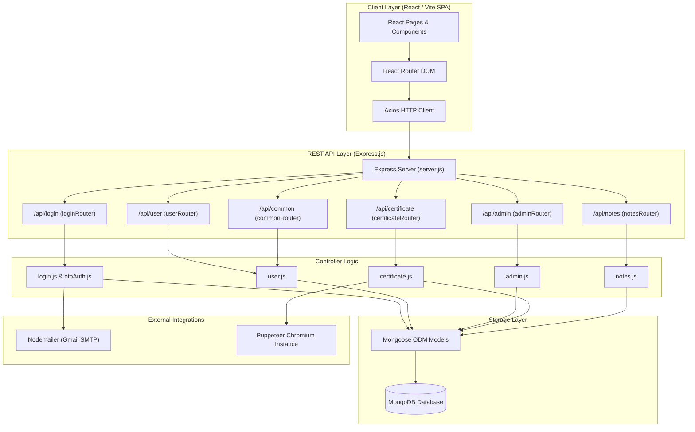
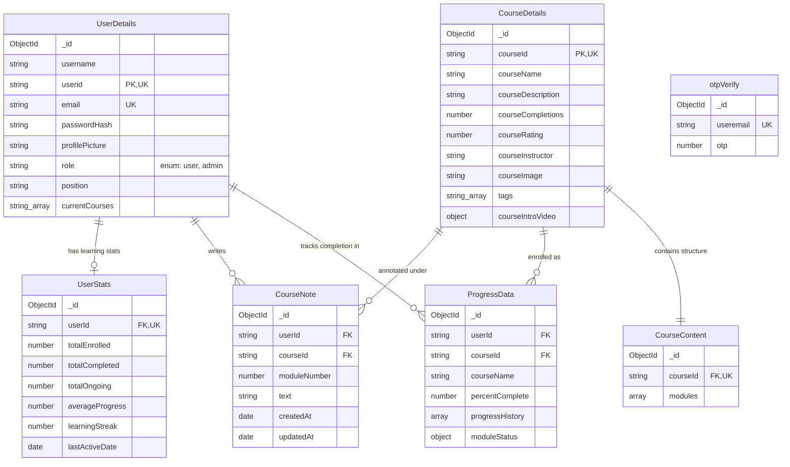
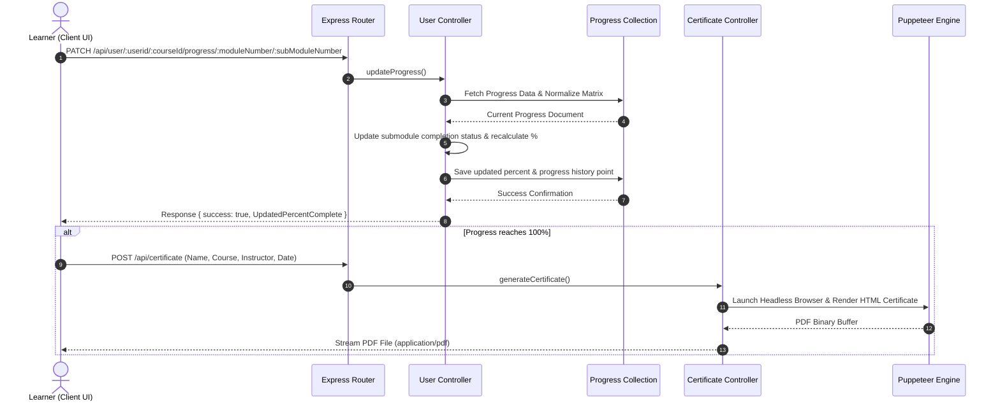

# 📚 EduTrack

EduTrack is a full-stack e-learning platform where users can explore courses, enroll, complete module-based video lectures and quizzes, track learning progress, and download completion certificates or monthly learning reports — while admins can monitor learners, manage user-course engagement, and create new courses.

---

## 🌍 Live Preview
- **Live URL:** [https://edu-track-flax.vercel.app/](https://edu-track-flax.vercel.app/)

### Demo Admin Credentials
- **Email:** `backups795@gmail.com`
- **Password:** `1234`
- *Note:* Dummy user to simulate admin dashboard capabilities.

---

## 1. System Overview

* **High-Level Purpose:** EduTrack provides an interactive e-learning ecosystem. It offers course catalog navigation, dynamic progress tracking based on submodule completion matrices, interactive video lessons, automated quiz validation, custom PDF certificate generation via Puppeteer, and email-based OTP user authentication.
* **Core Design Pattern:** Client-Server / Layered Architecture. The frontend is built as a Single Page Application (SPA) using React and Vite with client-side routing. The backend is an Express.js REST API structured around Model-Controller-Route layers interacting with MongoDB via Mongoose.

---

## 2. Technology Stack & Dependencies

| Category | Technology / Library | Purpose in this Project |
| :--- | :--- | :--- |
| **Frontend Framework** | React.js (v19) | Component-based UI rendering and state management |
| **Frontend Build Tool** | Vite (v6) | Development server and frontend asset bundler |
| **Routing** | React Router DOM (v7) | Client-side navigation and parameter management |
| **Data Visualization** | Chart.js & Recharts | Rendering progress-over-time graphs and learner analytics |
| **Styling** | Tailwind CSS & PostCSS | Utility-first CSS styling and responsive layout rules |
| **HTTP Client** | Axios | Executing asynchronous API requests between client and server |
| **Backend Runtime** | Node.js | Server-side JavaScript execution environment |
| **Web Framework** | Express.js (v4) | RESTful API endpoint routing and middleware execution |
| **Database & ODM** | MongoDB & Mongoose (v8) | Persistent document storage and Object Data Modeling |
| **Authentication Security** | bcrypt | Hashing and salting user passwords |
| **Document Generation** | Puppeteer (v24) | Headless Chrome browser automation for PDF certificate/report generation |
| **Email Service** | Nodemailer | Sending email OTP verification codes for signup & password resets |

---

## 3. High-Level Architecture Diagram



---

## 4. Directory & Module Structure

```
EduTrack/
├── client/                       # React Frontend Application
│   ├── src/
│   │   ├── assets/               # Static images and icons
│   │   ├── components/           # Reusable UI components (Navbar, CoursesCard, Module, Popup, etc.)
│   │   ├── pages/                # Top-level page views (Login, UserDashboard, CourseLearn, AdminDashboard, Profile, etc.)
│   │   ├── styles/               # CSS stylesheet modules per page and component
│   │   ├── App.jsx               # Application entry point with React Router routes
│   │   └── main.jsx              # React DOM root render
│   ├── package.json              # Client dependencies and scripts
│   └── vite.config.js            # Vite build setup
│
└── server/                       # Node.js Express Backend
    ├── controllers/              # Request handlers and business logic
    │   ├── admin.js              # Admin course/user management operations
    │   ├── certificate.js        # PDF generation using Puppeteer
    │   ├── login.js              # Password hashing, signup, authentication
    │   ├── notes.js              # Learner module notes management
    │   ├── otpAuth.js            # OTP generation and email dispatch
    │   └── user.js               # Learner dashboard, progress tracking, course enrollment
    ├── database/                 # Database setup
    │   └── connect.js            # Mongoose MongoDB connection initializer
    ├── middlewares/              # Express middlewares
    │   ├── error-handler.js      # Global error handling middleware
    │   └── not-found.js          # 404 route fallback
    ├── models/                   # Mongoose schemas
    │   ├── authOTP.js            # OTP verification temporary store
    │   ├── courseContent.js      # Modules, submodules, video links, quizzes
    │   ├── courseDetails.js      # Course metadata, ratings, instructors
    │   ├── courseNote.js         # User notes per course module
    │   ├── courseProgress.js     # User progress matrix and historical completion points
    │   ├── userDetails.js        # User account details and roles
    │   └── userStats.js          # Aggregated user learning statistics
    ├── routes/                   # Express endpoint routing definitions
    │   ├── adminRouter.js
    │   ├── certificateRouter.js
    │   ├── common.js
    │   ├── loginRouter.js
    │   ├── notesRouter.js
    │   └── userRouter.js
    ├── utils/                    # Utility helpers (Nodemailer, OTP generator)
    ├── package.json              # Server dependencies
    └── server.js                 # Express server startup file
```

---

## 5. Data Models & Database Schema



---

## 6. API Surface, Routes & Interfaces

### Auth & Login (`/api/login`)
| Method | Endpoint | Handler | Access | Description |
| :--- | :--- | :--- | :--- | :--- |
| POST | `/api/login/existinguser` | `loginValidation` | Public | Authenticates user with email & password |
| POST | `/api/login/signup/check` | `checkExistingUser` | Public | Checks if user email is already registered |
| POST | `/api/login/signup/send-otp` | `sendOTPController` | Public | Generates and emails OTP for signup |
| POST | `/api/login/signup/verify-otp` | `verifyOTPController` | Public | Validates signup OTP |
| POST | `/api/login/signup/newuser` | `signupValidation` | Public | Registers a new user account |
| POST | `/api/login/forgot-password/send-otp` | `sendOTPController` | Public | Sends password reset OTP |
| POST | `/api/login/forgot-password/verify-otp` | `verifyOTPController` | Public | Verifies password reset OTP |
| POST | `/api/login/forgot-password/reset-password` | `resetUserPassword` | Public | Updates user password after OTP verification |

### Learner Operations (`/api/user`)
| Method | Endpoint | Handler | Access | Description |
| :--- | :--- | :--- | :--- | :--- |
| GET | `/api/user/:userid` | `getAllCourses` | Learner | Fetches categorized courses (enrolled, available, completed) |
| GET | `/api/user/:userid/stats` | `getUserStats` | Learner | Retrieves user progress stats and learning streak |
| GET | `/api/user/:userid/:courseId` | `getCourseById` | Learner | Fetches course details, progress percent, and table of contents |
| GET | `/api/user/:userid/:courseId/module/:moduleNumber/:subModuleNumber` | `getSubModuleByCourseId` | Learner | Fetches specific submodule lesson and quiz |
| GET | `/api/user/:userid/:courseid/progress` | `getProgressMatrixByCourseId` | Learner | Retrieves completion matrix grid |
| GET | `/api/user/:userid/data/userinfo` | `getUserInfoByUserId` | Learner | Retrieves user profile data |
| PATCH | `/api/user/:userid/:courseId/progress/:moduleNumber/:subModuleNumber` | `updateProgress` | Learner | Marks submodule as complete and recalculates progress |
| GET | `/api/user/:userid/course/search` | `searchCourse` | Learner | Searches courses by tags |
| POST | `/api/user/:userid/:courseid/enroll` | `enrollUserInCourse` | Learner | Enrolls learner into a course |
| POST | `/api/user/:userid/course/:courseid/feedback` | `updateRating` | Learner | Submits course rating feedback |
| PATCH | `/api/user/:userid/user/data/editprofile` | `editProfile` | Learner | Updates username and profile photo |

### Admin Operations (`/api/admin`)
| Method | Endpoint | Handler | Access | Description |
| :--- | :--- | :--- | :--- | :--- |
| GET | `/api/admin/:adminid/course/allcourses` | `getAllCourses` | Admin | Retrieves all platform courses |
| GET | `/api/admin/:adminid/` | `getAllUsers` | Admin | Lists all registered users |
| GET | `/api/admin/:adminid/userdata/:userid` | `getUserById` | Admin | Fetches single user details |
| GET | `/api/admin/:adminid/progress/:employeeid` | `getProgressByUserId` | Admin | Retrieves course progress for an employee |
| GET | `/api/admin/:adminid/allusers/:courseId` | `getUserForCourse` | Admin | Lists all users enrolled in a specific course |
| GET | `/api/admin/:adminid/courseinfo/:courseId` | `getCourseInfoById` | Admin | Retrieves course details and syllabus for admin |
| POST | `/api/admin/:adminid/course/addnewcourse` | `addNewCourse` | Admin | Creates a new course with modules, lectures, and quizzes |
| PUT | `/api/admin/:adminid/promote/:userid` | `addNewUser` | Admin | Promotes user role to admin |
| PATCH | `/api/admin/:adminid/updateuserrole` | `updateUserRole` | Admin | Modifies a user's role |
| PATCH | `/api/admin/:adminid/user/data/editprofile` | `editProfileAdmin` | Admin | Updates user information from admin panel |

### Certificates & Reports (`/api/certificate`)
| Method | Endpoint | Handler | Access | Description |
| :--- | :--- | :--- | :--- | :--- |
| POST | `/api/certificate/` | `generateCertificate` | Learner | Generates and streams PDF completion certificate |
| GET | `/api/certificate/monthly/:userid` | `generateMonthlyLearningReport` | Learner | Generates and streams monthly learning report PDF |

### Notes (`/api/notes`)
| Method | Endpoint | Handler | Access | Description |
| :--- | :--- | :--- | :--- | :--- |
| GET | `/api/notes/:userid/:courseId/module/:moduleNumber` | `getNotesByModule` | Learner | Fetches notes written for a specific module |
| POST | `/api/notes/:userid/:courseId/module/:moduleNumber` | `createNote` | Learner | Saves a new module note |
| DELETE | `/api/notes/:userid/note/:noteId` | `deleteNote` | Learner | Deletes a note |

---

## 7. Key Data Flows & Sequences



---

## 8. Configuration & Environment Variables

### Server Configuration (`server/.env`)
* `PORT`: Port on which Express server listens (e.g. `5000` or `3000`).
* `MONGO_URI`: MongoDB connection string URI.
* `HASH_SALT`: Bcrypt salt rounds (e.g. `10`).
* `USER_EMAIL`: Gmail address for sending Nodemailer OTP emails.
* `EMAIL_PASSWORD`: Gmail App Password for SMTP authentication.

### Client Configuration (`client/.env`)
* `VITE_API_BASE_URL`: Base URL for Express backend REST API (e.g. `http://localhost:5000` or production deployment URL).

---

## 🛠️ Setup Instructions

### 1. Clone the repository
```bash
git clone https://github.com/abdul8704/EduTrack.git
cd EduTrack
```

### 2. Environment Configuration
Create a `.env` file in the `server` directory:
```env
PORT=5000
MONGO_URI=your_mongo_uri_here
HASH_SALT=10
USER_EMAIL=your_email_here
EMAIL_PASSWORD=your_email_app_password
```

Create a `.env` file in the `client` directory:
```env
VITE_API_BASE_URL=http://localhost:5000
```

### 3. Install Dependencies & Start Application

#### Run Server:
```bash
cd server
npm install
npm run start
```

#### Run Client:
```bash
cd client
npm install
npm run dev
```
