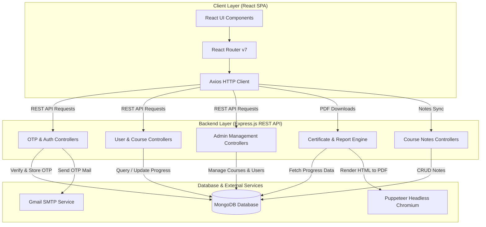
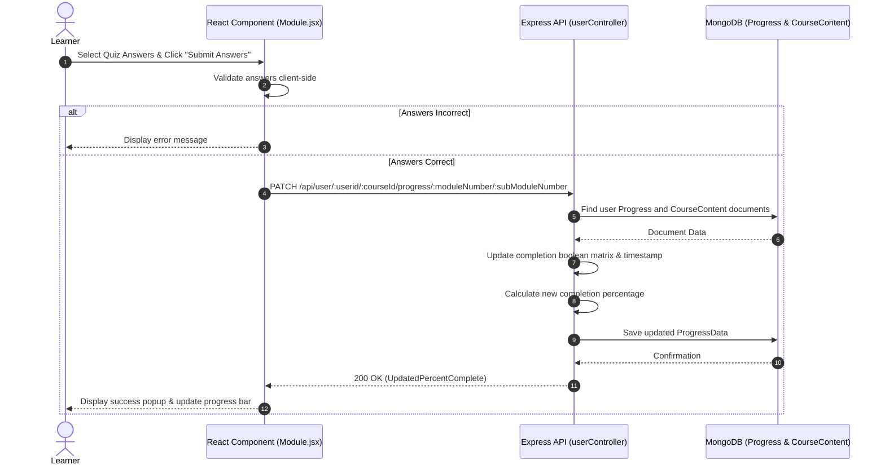

# 📚 EduTrack

EduTrack is a full-stack e-learning platform where users can explore courses, enroll, take quizzes, track learning progress, and download PDF certificates. Admins can manage courses, track user/employee progress, manage user roles, and monitor engagement metrics.

---

## 🌍 Live Preview

https://edu-track-flax.vercel.app/

To see the admin view, use:
- **Email**: `backups795@gmail.com`
- **Password**: `1234`
- *Note*: This is a dummy user configured to simulate the admin dashboard.

---

## 1. System Overview

### High-Level Purpose
EduTrack is designed to streamline online learning and progress management. It provides learners with course navigation, submodule video lessons, interactive module quizzes, learning streaks, progress charts, and automated PDF certificate/monthly report generation. For platform administrators, EduTrack provides administrative control over user promotion, custom course and quiz creation, and real-time learner tracking.

### Core Design Pattern
EduTrack follows a **Decoupled Client-Server Architecture**:
- **Frontend**: Single-Page Application (SPA) built with React 19, React Router v7, and Tailwind CSS.
- **Backend**: RESTful API service built with Express.js and Node.js following a Layered Architecture (Routes → Controllers → Mongoose Models → MongoDB).
- **Asynchronous Services**: Nodemailer for OTP email delivery and headless Puppeteer (Chromium) for server-side PDF document generation.

---

## 2. Technology Stack & Dependencies

| Category | Technology / Library | Purpose in this Project |
| :--- | :--- | :--- |
| **Frontend Framework** | React v19.1.0 | Component-based UI rendering |
| **Frontend Routing** | React Router DOM v7.6.1 | Client-side routing and page state navigation |
| **Build Tool** | Vite v6.3.5 | Frontend module bundling and hot module replacement (HMR) |
| **CSS / Styling** | Tailwind CSS v3.4.17 + PostCSS | Utility-first UI layout styling and responsive design |
| **HTTP Client** | Axios v1.9.0 | Client-side HTTP requests to backend REST API |
| **Data Visualization** | Chart.js / react-chartjs-2 & Recharts | Progress-over-time visual charts for user dashboards |
| **Icons** | Lucide React | Dashboard and navigation interface icons |
| **Backend Runtime** | Node.js / Express v4.21.2 | REST API web server hosting routes and controllers |
| **Database & ORM** | MongoDB + Mongoose v8.15.0 | NoSQL persistence and document object modeling |
| **Security & Auth** | bcrypt v6.0.0 | Password hashing with configurable salt rounds |
| **Email Service** | Nodemailer v7.0.3 | Transporting OTP verification codes via Gmail SMTP |
| **PDF Engine** | Puppeteer v24.10.0 | Headless Chrome browser automation for PDF rendering |
| **Utility Scripts** | `render-postinstall.js` | Platform-aware Chromium binary installation for Linux environments |

---

## 3. High-Level Architecture Diagram



---

## 4. Directory & Module Structure

```
EduTrack/
├── client/                     # Frontend Application (Vite + React)
│   ├── public/                 # Static assets
│   ├── src/
│   │   ├── assets/             # Brand logos and imagery
│   │   ├── components/         # Reusable UI widgets (Navbar, CourseDetails, Module, etc.)
│   │   ├── pages/              # Primary route pages (Login, UserDashboard, AdminDashboard, Profile, etc.)
│   │   ├── styles/             # Dedicated CSS stylesheets per view
│   │   ├── App.jsx             # React Router route paths declaration
│   │   ├── main.jsx            # Application entry point
│   │   └── index.css           # Global Tailwind CSS and custom scrollbars
│   ├── index.html              # Single page entry HTML
│   ├── package.json            # Client dependencies and build scripts
│   └── vite.config.js          # Vite build parameters
│
└── server/                     # Backend Application (Node.js + Express)
    ├── controllers/            # Controller business logic
    │   ├── admin.js            # Admin management operations
    │   ├── certificate.js      # Puppeteer certificate and report generation
    │   ├── common.js           # Common profile operations
    │   ├── login.js            # Authentication and password reset handlers
    │   ├── notes.js            # Course notes management
    │   ├── otpAuth.js          # OTP generation and email verification
    │   └── user.js             # User courses, progress matrix, and ratings
    ├── database/
    │   └── connect.js          # Mongoose database connection setup
    ├── middlewares/
    │   ├── error-handler.js    # Global async error handling middleware
    │   └── not-found.js        # 404 Route handling middleware
    ├── models/                 # Mongoose schemas
    │   ├── authOTP.js          # OTP verification collection
    │   ├── courseContent.js    # Module, submodule, video, and quiz schema
    │   ├── courseDetails.js    # Course metadata schema
    │   ├── courseNote.js       # Learner notes schema
    │   ├── courseProgress.js   # User course progress and completion matrix
    │   ├── userDetails.js      # User account and auth details schema
    │   └── userStats.js        # Aggregated learning stats and streaks
    ├── routes/                 # Express route definitions
    │   ├── adminRouter.js      # /api/admin API routes
    │   ├── certificateRouter.js# /api/certificate API routes
    │   ├── common.js           # /api/common API routes
    │   ├── loginRouter.js      # /api/login API routes
    │   ├── notesRouter.js      # /api/notes API routes
    │   └── userRouter.js       # /api/user API routes
    ├── utils/                  # Helper utilities (OTP generator, Nodemailer transporter)
    ├── render-postinstall.js   # Post-install Chromium downloader script
    ├── server.js               # Express application entry point
    └── package.json            # Server dependencies and scripts
```

---

## 5. Data Models & Database Schema

```mermaid
erDiagram
    UserDetails ||--o{ ProgressData : "tracks learning progress"
    UserDetails ||--o{ CourseNote : "creates"
    UserDetails ||--o1 UserStats : "has aggregated stats"
    CourseDetails ||--o1 CourseContent : "defines structure"
    CourseDetails ||--o{ ProgressData : "referenced in"

    UserDetails {
        string _id PK
        string username
        string userid UK
        string email UK
        string passwordHash
        string profilePicture
        string role "user | admin"
        string position
        string_array currentCourses
    }

    CourseDetails {
        string _id PK
        string courseId UK
        string courseName
        string courseDescription
        number courseCompletions
        number courseRating
        string courseInstructor
        string courseImage
        string_array tags
        object courseIntroVideo
    }

    CourseContent {
        string _id PK
        string courseId UK
        array_of_objects modules "moduleTitle, submodules"
    }

    ProgressData {
        string _id PK
        string userId
        string courseId
        string courseName
        number percentComplete
        array_of_objects progressHistory "date, percent"
        object moduleStatus "totalSubModules, completedModules[][], moduleCompletionDates[][]"
    }

    CourseNote {
        string _id PK
        string userId
        string courseId
        number moduleNumber
        string text
    }

    UserStats {
        string _id PK
        string userId UK
        number totalEnrolled
        number totalCompleted
        number totalOngoing
        number averageProgress
        number learningStreak
        date lastActiveDate
    }

    otpVerify {
        string _id PK
        string useremail UK
        number otp UK
    }
```

---

## 6. API Surface, Routes & Interfaces

### Authentication Routes (`/api/login`)
| Method | Endpoint | Handler | Description |
| :--- | :--- | :--- | :--- |
| `POST` | `/api/login/signup/check` | `checkExistingUser` | Validates if email already exists in system |
| `POST` | `/api/login/signup/send-otp` | `sendOTPController` | Sends account registration OTP to target email |
| `POST` | `/api/login/signup/verify-otp` | `verifyOTPController` | Verifies submitted registration OTP |
| `POST` | `/api/login/signup/newuser` | `signupValidation` | Hashes password and registers new user account |
| `POST` | `/api/login/existinguser` | `loginValidation` | Authenticates existing user credentials |
| `POST` | `/api/login/forgot-password/send-otp` | `sendOTPController` | Sends password reset OTP to user email |
| `POST` | `/api/login/forgot-password/verify-otp` | `verifyOTPController` | Verifies password reset OTP |
| `POST` | `/api/login/forgot-password/reset-password` | `resetUserPassword` | Updates user password with new hash |

### User Routes (`/api/user`)
| Method | Endpoint | Handler | Description |
| :--- | :--- | :--- | :--- |
| `GET` | `/api/user/:userid` | `getAllCourses` | Fetches categorized courses (enrolled, available, completed) |
| `GET` | `/api/user/:userid/stats` | `getUserStats` | Calculates and updates user streak and progress statistics |
| `GET` | `/api/user/:userid/data/userinfo` | `getUserInfoByUserId` | Fetches public details for a specified user |
| `GET` | `/api/user/:userid/:courseId` | `getCourseById` | Fetches course intro, completion percentage, and outline |
| `GET` | `/api/user/:userid/:courseId/module/:moduleNumber/:subModuleNumber` | `getSubModuleByCourseId` | Retrieves submodule video and quiz content |
| `GET` | `/api/user/:userid/:courseid/progress` | `getProgressMatrixByCourseId` | Returns boolean submodule completion matrix |
| `PATCH` | `/api/user/:userid/:courseId/progress/:moduleNumber/:subModuleNumber` | `updateProgress` | Marks submodule complete and updates percentage |
| `GET` | `/api/user/:userid/course/search` | `searchCourse` | Searches courses filtered by matching tags |
| `POST` | `/api/user/:userid/:courseid/enroll` | `enrollUserInCourse` | Enrolls user and initializes progress tracking document |
| `POST` | `/api/user/:userid/course/:courseid/feedback` | `updateRating` | Updates course average rating from feedback |
| `PATCH` | `/api/user/:userid/user/data/editprofile` | `editProfile` | Updates user profile name and image URL |

### Admin Routes (`/api/admin`)
| Method | Endpoint | Handler | Description |
| :--- | :--- | :--- | :--- |
| `GET` | `/api/admin/:adminid/` | `getAllUsers` | Fetches list of all registered users |
| `GET` | `/api/admin/:adminid/userdata/:userid` | `getUserById` | Retrieves individual user account information |
| `GET` | `/api/admin/:adminid/course/allcourses` | `getAllCourses` | Lists all courses created in system |
| `GET` | `/api/admin/:adminid/courseinfo/:courseId` | `getCourseInfoById` | Fetches admin view of course details and structure |
| `GET` | `/api/admin/:adminid/allusers/:courseId` | `getUserForCourse` | Lists all learners enrolled in a specific course |
| `GET` | `/api/admin/:adminid/progress/:employeeid` | `getProgressByUserId` | Retrieves progress reports across courses for an employee |
| `PUT` | `/api/admin/:adminid/promote/:userid` | `addNewUser` | Promotes target user to admin role |
| `PATCH` | `/api/admin/:adminid/updateuserrole` | `updateUserRole` | Updates explicit role of a user |
| `POST` | `/api/admin/:adminid/course/addnewcourse` | `addNewCourse` | Creates new course document along with content schema |
| `PATCH` | `/api/admin/:adminid/user/data/editprofile` | `editProfileAdmin` | Updates profile details from admin portal |

### Certificate & Report Routes (`/api/certificate`)
| Method | Endpoint | Handler | Description |
| :--- | :--- | :--- | :--- |
| `POST` | `/api/certificate/` | `generateCertificate` | Generates a completion certificate PDF using Puppeteer |
| `GET` | `/api/certificate/monthly/:userid` | `generateMonthlyLearningReport` | Generates monthly learning summary PDF (Rate-limited: 20 req/min) |

### Notes Routes (`/api/notes`)
| Method | Endpoint | Handler | Description |
| :--- | :--- | :--- | :--- |
| `GET` | `/api/notes/:userid/:courseId/module/:moduleNumber` | `getNotesByModule` | Fetches user notes created for a course module |
| `POST` | `/api/notes/:userid/:courseId/module/:moduleNumber` | `createNote` | Adds a new note for a specific module |
| `DELETE` | `/api/notes/:userid/note/:noteId` | `deleteNote` | Removes a specific note created by user |

---

## 7. Key Data Flows & Sequences

### Quiz Verification and Submodule Progress Update



---

## 8. Configuration & Environment Variables

### Server Environment Variables (`server/.env`)
```env
PORT=5000
MONGO_URI=mongodb+srv://<username>:<password>@cluster.mongodb.net/edutrack
HASH_SALT=10
USER_EMAIL=your_email@gmail.com
EMAIL_PASSWORD=your_gmail_app_password
```

### Client Environment Variables (`client/.env`)
```env
VITE_API_BASE_URL=http://localhost:5000
```

---

## 🛠️ Setup Instructions

1. **Clone repository**:
   ```bash
   git clone https://github.com/abdul8704/EduTrack.git
   cd EduTrack
   ```

2. **Configure environment variables** in both `server/.env` and `client/.env` as detailed above.

3. **Install server dependencies & start backend**:
   ```bash
   cd server
   npm install
   npm run start
   ```

4. **Install client dependencies & start frontend**:
   ```bash
   cd client
   npm install
   npm run dev
   ```
