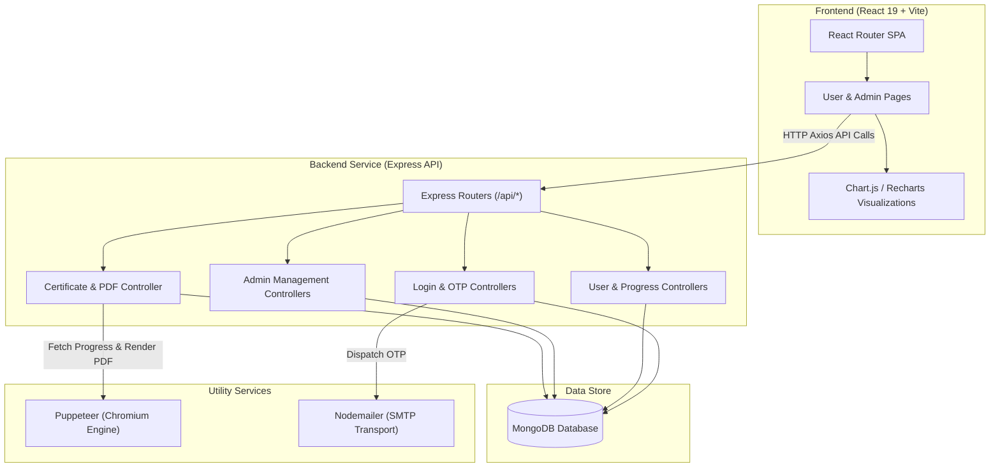
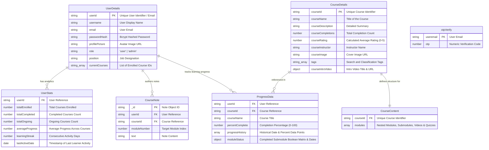

# 📚 EduTrack - System Architecture & Technical Documentation

EduTrack is a full-stack e-learning platform where users can explore courses, enroll, take quizzes, track learning progress, write module notes, and download certificates — while admins can monitor learners and manage user-course engagement.

---

## 🌍 Live Preview & Admin Credentials
- **Live URL:** [https://edu-track-flax.vercel.app/](https://edu-track-flax.vercel.app/)
- **Admin Access:**
  - **Email:** `backups795@gmail.com`
  - **Password:** `1234`
  - *Note:* Dummy admin user to simulate management capabilities.

---

## 1. System Overview

### High-Level Purpose
EduTrack provides an end-to-end learning management system (LMS). It enables users to browse categorized courses (Available, Ongoing, Completed), view video lectures, complete interactive submodule quizzes, monitor learning velocity with progress charts, and generate downloadable PDF certificates and monthly reports. Administrators are provided tools to promote users, view employee progress metrics, and author new courses complete with modules, lectures, and quizzes.

### Core Design Pattern
EduTrack uses a decoupled **Client-Server Architecture** with RESTful API communication:
- **Frontend (SPA):** Built with React 19 and Vite using component-based state management, client-side routing (`react-router-dom`), and visual charting (`chart.js` / `recharts`).
- **Backend (REST API):** Modular, layered Node.js/Express service. Controllers isolate business logic (progress calculation, certificate rendering, user promotion), Mongoose models handle persistent schemas, and middlewares govern global error handling and rate-limiting.

---

## 2. Technology Stack & Dependencies

| Category | Technology / Library | Purpose in this Project |
| :--- | :--- | :--- |
| **Frontend Core** | React 19, Vite | Single Page Application framework and rapid build tool |
| **Routing & Client State** | React Router DOM v7 | Client-side route management and URL parameter handling |
| **HTTP Client** | Axios | Asynchronous HTTP requests to backend endpoints |
| **Data Visualization** | Chart.js, react-chartjs-2, Recharts | Learner progress history plotting over time |
| **UI & Icons** | Tailwind CSS, Lucide React | Styling utility framework and iconography |
| **Backend Core** | Node.js, Express.js | Server environment and RESTful web server framework |
| **Database & ORM** | MongoDB, Mongoose v8 | NoSQL database and Object Data Modeling (ODM) |
| **Authentication & Security** | Bcrypt, Custom OTP | Password salted hashing and email-based OTP verification |
| **Document Generation** | Puppeteer v24 | Headless Chrome engine to render HTML into PDF certificates & reports |
| **Email Delivery** | Nodemailer | SMTP transport integration for OTP verification emails |

---

## 3. High-Level Architecture Diagram



---

## 4. Directory & Module Structure

```
EduTrack/
├── client/                       # React Single Page Application
│   ├── src/
│   │   ├── assets/               # Brand assets & static images
│   │   ├── components/           # Reusable UI components (Navbar, CourseDetails, Module, etc.)
│   │   ├── pages/                # Page views (UserDashboard, AdminDashboard, Profile, etc.)
│   │   ├── styles/               # CSS stylesheets per component/view
│   │   ├── App.jsx               # Application routing table
│   │   └── main.jsx              # React application entry point
│   ├── index.html                # HTML template entry
│   ├── package.json              # Client dependencies
│   └── vite.config.js            # Vite build configuration
└── server/                       # Express REST API Server
    ├── controllers/              # Business logic handlers
    │   ├── admin.js              # Admin management logic
    │   ├── certificate.js        # Puppeteer PDF generation (Certificates & Reports)
    │   ├── login.js              # Password validation & signup handlers
    │   ├── notes.js              # Learner module notes management
    │   ├── otpAuth.js            # OTP generation & validation
    │   └── user.js               # User course interactions & progress tracking
    ├── database/                 # MongoDB Mongoose connection setup
    ├── middlewares/              # Express middlewares (error handler, route fallback)
    ├── models/                   # Mongoose data schemas
    ├── routes/                   # Router definitions
    ├── utils/                    # Nodemailer SMTP and OTP generator helpers
    ├── render-postinstall.js     # Post-install Chromium installer script for Linux
    ├── package.json              # Server dependencies
    └── server.js                 # Server startup & DB connection entry
```

---

## 5. Data Models & Database Schema



---

## 6. API Surface, Routes & Interfaces

### Authentication & Login Routes (`/api/login`)
| Method | Endpoint | Handler | Access | Description |
| :--- | :--- | :--- | :--- | :--- |
| `POST` | `/api/login/existinguser` | `loginValidation` | Public | Validate credentials and authenticate user |
| `POST` | `/api/login/signup/check` | `checkExistingUser` | Public | Check if email is already registered |
| `POST` | `/api/login/signup/send-otp` | `sendOTPController` | Public | Generate and send email OTP for registration |
| `POST` | `/api/login/signup/verify-otp` | `verifyOTPController` | Public | Validate submitted signup OTP |
| `POST` | `/api/login/signup/newuser` | `signupValidation` | Public | Hash password and register new user |
| `POST` | `/api/login/forgot-password/send-otp` | `sendOTPController` | Public | Send password reset OTP via email |
| `POST` | `/api/login/forgot-password/verify-otp` | `verifyOTPController` | Public | Verify password reset OTP |
| `POST` | `/api/login/forgot-password/reset-password` | `resetUserPassword` | Public | Update user password hash |

### Learner Operations (`/api/user`)
| Method | Endpoint | Handler | Access | Description |
| :--- | :--- | :--- | :--- | :--- |
| `GET` | `/api/user/:userid` | `getAllCourses` | User/Admin | Fetch enrolled, available, and completed courses |
| `GET` | `/api/user/:userid/stats` | `getUserStats` | User/Admin | Retrieve user analytics and streak data |
| `GET` | `/api/user/:userid/data/userinfo` | `getUserInfoByUserId` | User/Admin | Get public user profile info |
| `GET` | `/api/user/:userid/:courseId` | `getCourseById` | User/Admin | Fetch course details, TOC, and user progress |
| `GET` | `/api/user/:userid/:courseId/module/:moduleNumber/:subModuleNumber` | `getSubModuleByCourseId` | User/Admin | Fetch submodule content, video URL, and quiz |
| `GET` | `/api/user/:userid/:courseid/progress` | `getProgressMatrixByCourseId` | User/Admin | Get completion matrix for a course |
| `PATCH` | `/api/user/:userid/:courseId/progress/:moduleNumber/:subModuleNumber` | `updateProgress` | User/Admin | Update submodule completion status and percentage |
| `GET` | `/api/user/:userid/course/search` | `searchCourse` | User/Admin | Search courses by intersection of tags |
| `POST` | `/api/user/:userid/:courseid/enroll` | `enrollUserInCourse` | User/Admin | Enroll user and initialize progress tracking |
| `POST` | `/api/user/:userid/course/:courseid/feedback` | `updateRating` | User/Admin | Submit course rating and update average |
| `PATCH` | `/api/user/:userid/user/data/editprofile` | `editProfile` | User/Admin | Update user profile picture and display name |

### Admin Management (`/api/admin`)
| Method | Endpoint | Handler | Access | Description |
| :--- | :--- | :--- | :--- | :--- |
| `GET` | `/api/admin/:adminid/course/allcourses` | `getAllCourses` | Admin Only | Fetch summaries of all system courses |
| `GET` | `/api/admin/:adminid/` | `getAllUsers` | Admin Only | List all registered users |
| `GET` | `/api/admin/:adminid/userdata/:userid` | `getUserById` | Admin Only | Get target user details |
| `GET` | `/api/admin/:adminid/progress/:employeeid` | `getProgressByUserId` | Admin Only | Get progress details for a specific employee |
| `GET` | `/api/admin/:adminid/allusers/:courseId` | `getUserForCourse` | Admin Only | Get list of enrolled users and completions for a course |
| `GET` | `/api/admin/:adminid/courseinfo/:courseId` | `getCourseInfoById` | Admin Only | Get course overview and module hierarchy |
| `PUT` | `/api/admin/:adminid/promote/:userid` | `addNewUser` | Admin Only | Promote user to admin status |
| `PATCH` | `/api/admin/:adminid/updateuserrole` | `updateUserRole` | Admin Only | Update specified user role |
| `POST` | `/api/admin/:adminid/course/addnewcourse` | `addNewCourse` | Admin Only | Add a new course with modules, lectures, and quizzes |
| `PATCH` | `/api/admin/:adminid/user/data/editprofile` | `editProfileAdmin` | Admin Only | Edit target user profile (role, position, picture) |

### Certificates & Reports (`/api/certificate`)
| Method | Endpoint | Handler | Access | Description |
| :--- | :--- | :--- | :--- | :--- |
| `POST` | `/api/certificate/` | `generateCertificate` | User/Admin | Render HTML and stream A4 PDF course completion certificate |
| `GET` | `/api/certificate/monthly/:userid` | `generateMonthlyLearningReport` | Rate Limited | Render and stream A4 PDF monthly progress report |

---

## 7. Key Data Flows & Sequences

### Submodule Completion & Certificate Download Flow

```sequenceDiagram
    autonumber
    actor Learner as Learner
    participant UI as React Client
    participant API as Express API Server
    participant DB as MongoDB
    participant Puppeteer as Puppeteer Chromium

    Learner->>UI: Select Quiz Answers & Click Submit
    UI->>UI: Validate answers client-side
    alt Answers Valid
        UI->>API: PATCH /api/user/:userid/:courseId/progress/:module/:submodule
        API->>DB: Fetch ProgressData & update boolean matrix
        API->>API: Calculate new completion percentage & append progressHistory
        API->>DB: Save updated ProgressData
        API-->>UI: Return 200 OK (UpdatedPercentComplete)
        UI-->>Learner: Display updated progress bar & feedback
    end

    opt Progress Reaches 100%
        Learner->>UI: Click 